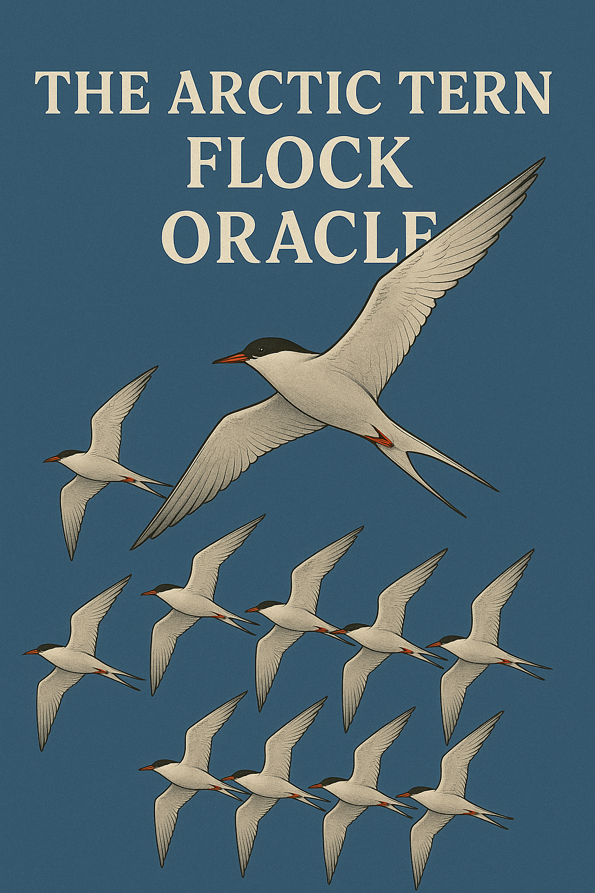

##  The Artic Tern Flock Oracle - Arbitary Multi Asset ERC20 Oracle

Artic Tern's security comes from having a $REP$ asset that:
1) **Is valuable**: It gets fees from the use of the platform
2) **Can Fork**: The asset can split into multple universes
3) **Is a backstop**: It's being sold in auction to recover open interest

There's no reason we couldn't deploy one indepentent Artic Tern system for each token. Each Artic Herd REP gets fees and backstops each respective asset:
- $REP_{DAI}$: Gets fees from DAI markets, backstops DAI markets in DAI. Guarantees that: $\text{DAI Open Interest} < REP_{DAI}$  Market Cap
- $REP_{ETH}$: Gets fees from ETH markets, backstops ETH markets in ETH. Guarantees that: $\text{ETH Open Interest} < REP_{ETH}$  Market Cap
- $REP_{POOP}$: Gets fees from POOP markets, backstops POOP markets in POOP. Guarantees that: $\text{POOP Open Interest} < REP_{POOP}$ Market Cap

### Joining the Birds ogether
We can use the same markets for each Artic Tern Oracle. When you mint shares in one universe, you get shares in that universe in that denomination.

We can go further in joining the systems together. When one Artic Tern forks, we can fork all the other Artic Terns the same way, each $REP$ token in their respective universes back the traders in their respective universes, just like $REP_{lie}$ is backing traders in lie universe and $REP_{truth}$ is backing truth universe traders. Artic Terns can follow each others this way, as they can repeat all the forks of all the universes, following the same path.

However, how to determine when a fork happens? If each $POOP$ and $FOOD$ token can decide when we are going to fork, we are going to fork all the time, as the $POOP$ and $FOOD$ rep tokens might not have any value. As we use escalation game to determine when to fork, this escalation game needs a valuable token that can fork.

We can elect one Artic Tern Oracle to be a leader Oracle (**Leader Bird**), and we can **remove all the oracle cababilities** (designated reporter, escalation game, fork decision) from the other Artic Terns (**Following Bird**).

### Selecting a leader bird
The natural option for Leader Bird is $ETH$ universe. Leader Bird behaves exactly the same as an individual Artic Tern. The leader is not knowledgeable of the other universes. The other artic tern universes are completely **parasitic** to the leader bird. The other following birds just looks at what $ETH$ oracle does and forks/decides oracle resolutions accordingly.

From perspective of $POOP$ token traders, it's important that $REP_{POOP}$ is valuable. And it is valuable if, $POOP$ tokens have value and there's fee paying open interest in the universe. It is also important that the escalation game in the $ETH$ universe requires enough value to be burnt in order to avoid griefing. Thus $POOP$ universe pays a fraction of its open interest fee to $ETH$ universe holders in $POOP$ tokens.

When $ETH$ universe decides that it's time to fork, $POOP$ universe will just fork and conduct the appropriate auctions; selling $REP_{\text{POOP Truth}}$ and $REP_{\text{POOP Lie}}$ for $POOP$ tokens.

### Is there a better option for leader bird?
Currently all the Following Birds pays the security of $ETH$ universe and their own security, this makes these universes more expensive than $ETH$ universe is. Instead of picking $ETH$ as the leader bird. We can create new universe: **Leader** ($REP_{Leader}$), and demote $ETH$ to be a follower bird. This **leader universe does not contain any open interest** and thus does not get any fees from it's open interest. This leader universe is used for all the oracle functions. This universe needs to be valuable as it has the power to decide oracle outcome and ultimately fork all the followers. Thus all the following universes pay a fee to the leader universe to make sure it's valuable.

To extract original $REP_{ETH}$ token from the system, you can hold the $REP_{ETH, following}$ and $REP_{Leader}$ token, and it behaves functionally the same as normal Artic Tern, except you get more fees in random tokens.