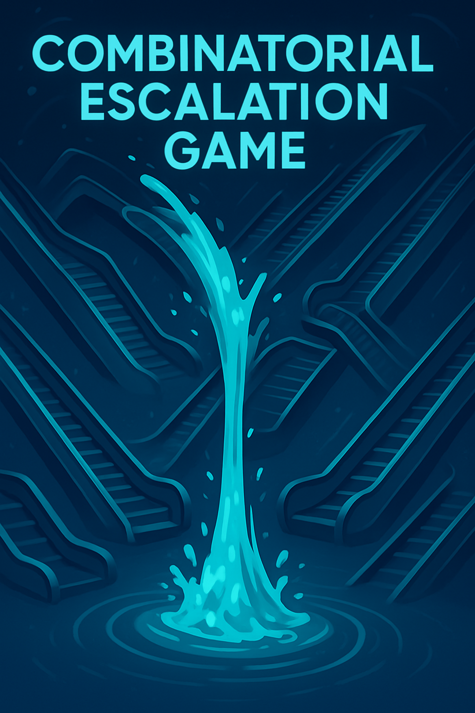

# Combinatorial Escalation Game

In the Combinatorial Escalation Game, participants place bets on combinations of outcomes across multiple markets. For example, a player like Bob might bet that *Market A* will resolve to **True** and *Market B* to **False**, expressed as:
`[A-True, B-False]`.

### Rules:
* **Combination Bets**: Players can include any number of markets in a bet, but each market may only appear once per bet.
* **Partial Bets**: Bets do not need to cover all disputed markets. Omitting a market indicates that the player has no preference regarding its outcome. This commonly happens when new market disputes are added after a bet is already placed.
* **Bet Returning Conditions**: The staked $REP$ on a bet is only returned back if **all** listed outcomes match the final resolutions exactly. For example, the bet `[A-True, B-False]` is only returned if *A* resolves to **True** and *B* to **False**.
* **Partial Winning**: The bet can win partially when E. g, market A resolves to true first, which pays out $REP$, while the bet itself is still being locked inside the system.

>![WARNING]
>TODO: Partial winnings could be locked into the contract, and only paid out if the whole bets turn out to be correct. If one of the bets fails, the wins are burned (the bet stake itself is paid to winner). This removes incentive to reorder markets, but its still possible to grief profit from other users by getting it burnt.

### Bet Amendments:
Players may freely extend existing bets by adding predictions for newly introduced markets. For instance, if a player originally wagered 100 $REP$ on `[A-True]`, they can later update it to `[A-True, B-False]` - still with the same 100 $REP$ stake - without additional cost.
Each market runs its own [Fluid Escalation Game](/Fluid%20Escalation%20Game.md). When a combinatorial bet is placed, its stake is added to the escalation game of every market involved in the bet.

### Resolution Mechanics

When a market's Escalation Game resolves - either by reaching a resolution or via a system fork - all combinatorial bets that include a losing outcome for that market are removed from the system. The full stake of these losing bets is paid out to the winning side of the resolving market. Importantly, once the stake is paid out, it is also withdrawn from the escalation games of any other markets that the bet was touching.

>[!NOTE]
> #### Example:
> Suppose Market A resolves to True, and there's a 100 $REP$ bet on `[A-False, B-True]`. This is a losing bet, so:
> * The 100 $REP$ is paid to the winning side of Market A.
> * That 100 $REP$ is also removed from Market B's escalation game.
>
> Similarly, a 5 $REP$ bet on `[A-False, C-False]` would be removed from Market C’s escalation game.

### Fork Handling Options
When a market forks, the system must choose how to handle the unresolved combinatorial bets. There are two main approaches:
1. **Refund Approach (Augur v2 style)**
   All stake from bets involving non-forking markets is returned to users.

   * **Drawback**: This enables free attacks on non-forking markets if a fork is expected elsewhere in the system.

2. **Universe Split with Stake Migration**
   Each escalation game is split into separate versions for each universe created by the fork.

   * Participants can **migrate their locked $REP$** into the universe(s) of their choice.
   * A bet migrated into one universe is treated as **withdrawn** in all others.
   * The Fluid Escalation Games update each market’s resolution time, adding delay to reflect the shifting state and uncertainty during a fork.

> [!NOTE]
> #### Example: Resolve Out Of Order
> 1) Bob stakes 100 $REP$ on [A-True, B-False]
> 2) Alice disputes with 200 $REP$ on [A-False, B-False]. Tally:
> - A-True = 100 $REP$
> - A-False = 200 $REP$
> - B-False = 300 $REP$
>3) As B-False did not get disputes, it resolves to False and we have
> - A-True = 100 $REP$
> - A-False = 200 $REP$

> [!NOTE]
> #### Example: Stake pulling when REP is lost to a bet
> 1) Bob stakes 100 $REP$ on [A-True, B-True]
> 1) Cecilia stakes 200 $REP$ on [A-False]
> 2) Alice disputes with 200 $REP$ on [A-False, B-False]. Tally:
> - A-True = 100 $REP$ (Bob)
> - A-False = 400 $REP$ (Cecilia, Alice)
> - B-True = 100 $REP$ (Bob)
> - B-False = 200 $REP$ (Alice)
>3) A resolves to False, Bob loses the whole stake, new tally:
> - B-True = 0 $REP$
> - B-False = 200 $REP$ (Alice)
>4) B resolves to False as there's no disputes, Alice does't return profit for her 200 $REP$ as it was not disputed.

In Augur V2, a staker who chooses the correct outcome can expect a 40% return on investment - calculated as a 50% reward minus a 10% burn on the losing side's stake. This reward structure is designed to incentivize profit-seeking participants to stake and actively express their opinions on market outcomes.

However, this guaranteed profit expectation does not apply in combinatorial games. In these games, a stake can be prematurely removed from a market's escalation game if it has already lost due to another market in the same combinatorial bet resolving unfavorably. For example, if Alice placed a bet on `[A-False, B-False]` and Market A resolves to True, her entire stake is considered lost - even if Market B hasn't resolved yet. Consequently, the stake is pulled out of Market B's escalation game, eliminating any potential profit from that part of the bet.

Another issue arises from the dependency on market resolution order, which can significantly impact a user's payout. For example, consider a bet on `[A-False, B-False]`, where:

* A resolves to False (a winning prediction)
* B resolves to True (a losing prediction)

In this case, the timing matters. If A resolves before B, the user receives a payout for the A-False portion before the bet is invalidated by B's resolution. However, if B resolves first, the entire bet is considered lost and no payout is made—even though *A* would have been correct.

This creates a potential incentive for users to influence the resolution order of markets in an order that maximizes their own payouts.

## PRO's and CON's of Combinatorial Escalation Game
- We only need enough honest $REP$ to win a dispute in a single market, as this honest stake can stake on all the markets
- Winning an Escalation Game bet might not result in winning anything due to opposing bets being pulled out
- A griefing participant can delay the resolution of all the markets with the same stake
- An opportunistic participant can also delay the resolution of all the  disputed markets. If an opportunistic reporter notices they are wrong on one Escalation Game, they can expand their "already lost" stake into all of the markets in the dispution queue for free.
- There is a path dependency, the order of on how disputes resolve have impact on the other disputes and their profitability.