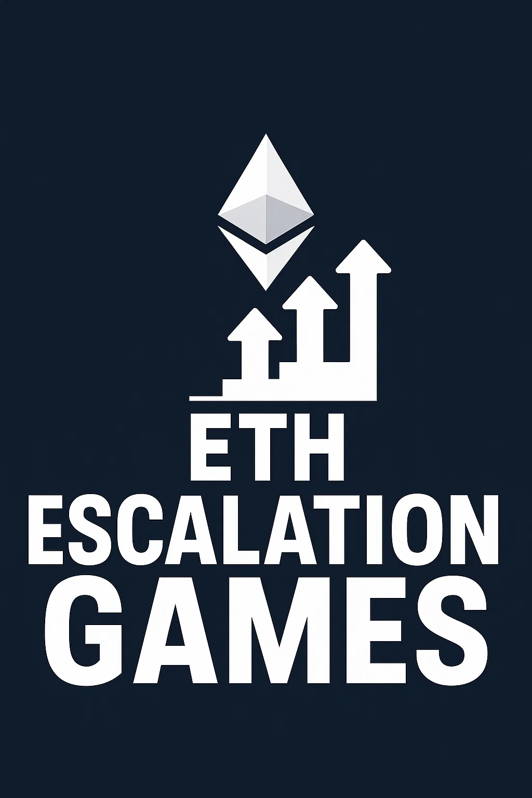

# ETH Escalation Games


Using $ETH$ for escalation games is preferable to using $REP$, primarily due to better liquidity and broader ecosystem support.

$REP$ faces limitations because it's liquidity is relatively low and confined to a single set of smart contracts. Additionally, $REP$ can undergo forks, which would immediately break its integration with external protocols and further reduce its utility in escalation scenarios.

The [Dual Escalation Game](./Dual%20Escalation%20Game.md) can be transformed into a fully $ETH$-based escalation game by treating the both currencies the same and when a fork happens the $REP$ portion of the dual escalation game is converted to $REP$ (the $ETH$ part is given to open interest holders to cover their fees).

If the escalation game ends in a timeout, the $ETH$ is given to 
the game participants in $ETH$ (minus the 20% burn). However, if a fork happens, a dutch auction with pre-bidding is started where the $ETH$ is sold for $REP$. After this auction concludes, the purchased $REP$ is not given straight to the game participants, but its split into forked universes (eg, true, and false universes) and then given to the game participants.

We also not give some fractiction of this $ETH$, eg 20% to the game participants. We can either give the share to current $REP$ holders prior the auction or we can decide to burn the $ETH$.

## Auction

When a fork happens, we need to sell the escalation game $ETH$ to $REP$. As the escalation participants (given they are right) are expected to get a huge return on their investment, it's okay that some auction loss occurs.

## Fork Threshold
Since the Fork Threshold is denominated in $REP$, we need to define how it translates into $ETH$. We aim for the Fork Threshold to satisfy the following criteria:
1. **Scale with platform usage** - Forking should become harder as usage increases, since the potential harm scales with usage.
2. **Non-zero base cost** - Even with no current usage (e.g., Open Interest is zero), forking should still carry a cost, as it imposes risks on $REP$ holders and future users.
3. **Remain economically feasible** - Forking should still be possible with a reasonable amount of capital.

To satisfy these requirements, we define the Fork Threshold as:

```math
\text{Fork Threshold} = \max(\text{Open Interest Fraction} \cdot \text{Open Interest}, \text{REP Fraction} \cdot \text{TWAP}_{ETH/REP} \cdot \text{REP Supply})
```

This ensures:
* Requirement (1) is met by scaling with Open Interest
* Requirement (2) is met by the second term, which sets a baseline cost based on the $REP$ supply
* Requirement (3) is addressed by tuning the fraction values

We assume both fractions (Open Interest Fraction and REP Fraction) can be the same, as there's no compelling reason to decouple them.

While the second term will typically dominate (especially if $REP$ maintains a healthy market cap), the first term ensures that the Fork Threshold remains meaningful even if the TWAP is inaccurate. Open Interest is a more direct, verifiable metric, making it a reliable fallback.

Note that while Open Interest can be artificially inflated - by injecting funds, triggering disputes, and withdrawing funds - this is acceptable. The Open Interest component primarily serves as a safeguard in cases where price oracles fail or when the system's security is already compromised (e.g., when REP market cap falls below Open Interest).

The Fork Threshold can vary between markets, as it is set at the start of each escalation game. While it's possible to allow the threshold to change over time, doing so would introduce unpredictability into the game, since participants wouldn't know in advance what capital is required to trigger a fork. This uncertainty could undermine the strategic clarity and fairness of the escalation process.

# TWAP Price Oracle
To ensure the TWAP calculation is as resistant to manipulation as possible, we should use a method that is both secure and feasible to compute on-chain. One of the most robust options is the Geometric Mean TWAP, which remains reasonably efficient while limiting price changes between blocks to a bounded range (e.g. -50% to +100%). This constraint helps mitigate two-block manipulation attacks. That said, the TWAP in this context doesn't need to be extremely precise, since it's only used to determine the size of the Escalation Game.

There's more analysis about this topic in these sources:

[So You Want To Use TWAP](https://medium.com/@chinmayf/so-you-want-to-use-twap-1f992f9d3819)

[Uniswap v3 Oracles](https://blog.uniswap.org/uniswap-v3-oracles)

[TWAP Oracle Attacks: Easier Done than Said?](https://eprint.iacr.org/2022/445.pdf)

[Manipulating Uniswap v3 TWAP Oracles](https://github.com/euler-xyz/uni-v3-twap-manipulation/blob/master/cost-of-attack.pdf)
