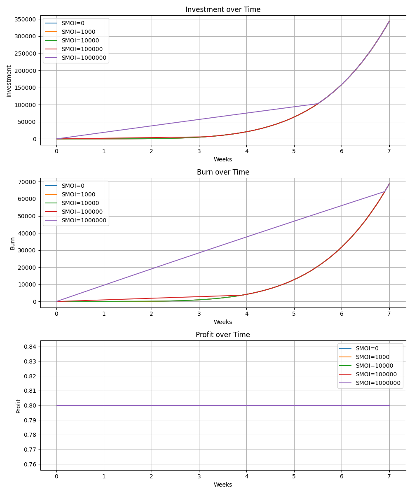

# Fix Open Interest Fee Griefing on Escalation Games
To fix open Interest griefing (as described in [Open Interest Fee Griefing](/Open%20Interest%20Fee%20Griefing.md)), we need to ensure that the cost to delay the system costs atleast the same amount than can be extracted from open interest fees.

## Requirements for good functions
Here's all the requirements we prefer the $\text{investment}(t)$ and $\text{burn}(t)$ functions of escalation game to function:

**Fixed Length game**: $t \in [0, t_{\text{Max}}]$

**Profitability:**
```math
\forall t \in [0, t_{\text{Max}}],\quad \frac{\text{payoff}(t) - \text{investment}(t)}{\text{investment}(t)} > \frac{2}{5}
```
**Burn Lower Bounds:**
```math
\forall t \in [0, t_{\text{Max}}],\quad 
\text{burn}(t) \geq \text{Single Market Open Interest} \cdot \left(1 - e^{-oiFee \cdot t}\right)
```

```math
\text{burn}(t) \geq \frac{1}{5} \text{investment}(t)
```

```math
\text{burn}(t) \geq 0
```

**Investment Conditions:**
```math
\forall t \in [0, t_{\text{Max}}],\quad \text{investment}(t) \geq 0
```
```math
\text{investment}(t_{\text{Max}}) = \text{Fork Treshold} + \text{burn}(t_{\text{Max}})
```

**Monotonicity and Continuity:**

```math
\text{investment}(t) \text{ and } \text{burn}(t) \text{ are continuous on } [0, t_{\text{Max}}]
```

```math
\forall t \in [0, t_{\text{Max}}],\quad \text{investment}(t) - \text{investment}(t - \varepsilon) > 0
```

```math
\forall t \in [0, t_{\text{Max}}],\quad \text{burn}(t) - \text{burn}(t - \varepsilon) > 0
```

**Investment amount accelerates:**
```math
\text{investment}''(t) >= 0
```
## Found functions:

Here is a set of functions that satisfies these criteria:
```math
\begin{aligned}
\text{investment}(t) &= \max \left( 
     \text{Start Deposit}, \ 
     \alpha \cdot \text{burn}(t), \ 
     \text{Start Deposit} + \text{Growth} \cdot \left( \frac{t}{t_{\max}} \right)^k 
   \right) \\[1.5em]
\text{burn}(t) &= \max \left( 
     \text{Single Market Open Interest} \cdot \left( 1 - e^{- \text{oiFee} \cdot t} \right), \ 
     \frac{1}{5} \left( 
       \text{Start Deposit} + \text{Growth} \cdot \left( \frac{t}{t_{\max}} \right)^k 
     \right) 
   \right) \\[1.5em]

\text{Growth} &= \text{Fork Threshold} 
   + \max \left( 
       \text{Single Market Open Interest} \cdot \left( 1 - e^{- \text{oiFee} \cdot t_{\max}} \right), \ 
       \frac{1}{4} \text{Fork Threshold} 
     \right) 
   - \text{Start Deposit} \\[1.5em]
k &= 5, \quad k \in [2, \infty[ \\[0.5em]
\alpha &= 2, \quad \alpha \in \left[ \frac{5}{3}, \infty \right[
\end{aligned}
```

With parameters:

| Parameter      | Value   |
| -------------- | ------- |
| Open Interest Fee (yearly) | 50%  | 
| Time Limit     | 7 weeks |
| Number Of Weeks In a Year     | 52 weeks |
| Start Deposit | 0.4  | 
| Fork Theshold | 275 000  | 

These produce following curves:

([Python Script](/scripts/escalation_game_plot.py) )

## Challenges
- Escalation game depends on open interest of the underlying market (bit difficult for [FLOCK](./Artic%20Tern%20Flock%20Oracle.md))
- We need to have price oracle to convert the fees to REP. This doesn't need to be super accurate, but its better if it bit over estimates the open interest ($\alpha=2$, supports error of 100%).
- We need accumulator of oIFee if we allow it to change, easier if we lock it (dependency on oIFee is bit difficult for Flock too). Again, its better to over estimate it than under-estimate
- Markets Open Interest cannot grow during the escalation game, shrinking is fine, as it just results in more relative burning