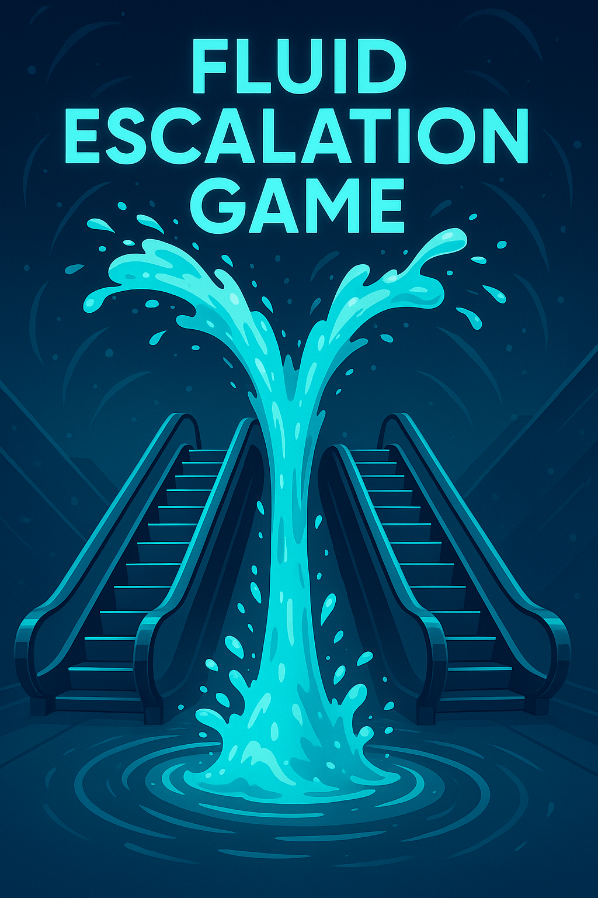

# Fluid Escalation Game

The Fluid Escalation Game is a dynamic staking mechanism where users can continuously pre-stake funds on their preferred market outcome while the game is live.

Pre-staking means a user commits funds to an outcome, signaling intent to back it, but the funds are not yet binding unless they are matched by an opposing stake. Once a matching bet is made, the pre-stake becomes binding instantly up to the matched stake, the overflowing funds of the matched bet will be added to pre-staking.

Every time new binding capital is added, the resolution time of the market is extended. This gives the currently losing side a fair chance to gather more capital and respond.

Binding stakes earn a return similar to Augur V2 - a 40% reward - while pre-staked (but unmatched) funds do not earn a return.

When the resolution timer runs out, the market resolves in favor of the currently leading outcome - unless enough $REP$ is staked to initiate a fork in the market.
