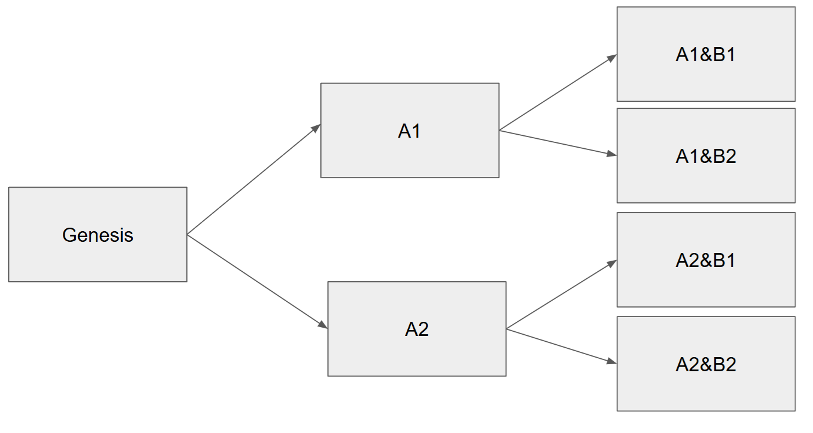

# Lazy Forking in Partial Colored Coins

Lazy forking allows us to fork only a specific market and liquidate its open interest, while leaving all other markets unchanged - avoiding unnecessary liquidation in markets unaffected by the dispute.

>[!NOTE]
> #### Example: Double Fork
> 
> Suppose we have two markets in the Genesis universe: Market A and Market B.
> 
> A dispute arises in Market A, triggering a fork. We liquidate the open interest in Market A and split the original REP tokens into two universe-specific tokens: $REP_{A1}$ and $REP_{A2}$, depending on the outcome of the fork.
> 
> ```math
> \text{REP}_{\text{genesis}} \rightarrow 
> \begin{cases}
> \text{REP}_{A1} & \text{if A1 is true} \\
> \text{REP}_{A2} & \text{if A2 is true}
> \end{cases}
> ```
> 
> Market B, which also existed in the Genesis universe, continues as normal and does not need to fork or liquidate its open interest unless a dispute arises within it.
> 
> However, if a dispute does occur in Market B after A has already forked, then Market B must fork within both $A1$ and $A2$ universes:
> 
> ```math
> \text{REP}_{A1} \rightarrow 
> \begin{cases}
> \text{REP}_{A1 1} & \text{if B resolves to B1} \\
> \text{REP}_{A1 B2} & \text{if B resolves to B2}
> \end{cases}
> ```
> 
> ```math
> \text{REP}_{A2} \rightarrow 
> \begin{cases}
> \text{REP}_{A2 B1} & \text{if B resolves to B1} \\
> \text{REP}_{A2 B2} & \text{if B resolves to B2}
> \end{cases}
> ```
> 
> So if you're holding shares in outcome $B1$, your open interest will be split across $REP_{A1 B1}$ and $REP_{A2 B1}$.
> 
> 
> 

## Escalation Game in Lazy Forking

In Augur V2, the escalation game uses the current REP token, which means when a universe forks, all markets must migrate to the new universe - every market is affected.

With lazy forking, this isn't necessary. However, it introduces a new problem: which token should be used for the escalation game?

After Market A has forked, we now have $REP_{A1}$ and $REP_{A2}$. Market B, which hasn't forked yet, doesn't know which universe is truthful. If both REP tokens were allowed in the dispute process, it would give value to the lying universe - something we want to avoid.

One workaround might be to use the original $REP_{genesis}$ token and require users to back-migrate from $REP_{A1}$ or $REP_{A2}$ to participate. But again, this provides utility (and thus value) to a potentially lying universe.

### Proposed Solution

The cleanest solution is to remove $REP$ from the escalation game entirely and use an external token, say $EXT$.

* $EXT$ is used to conduct the escalation game, similar to how REP is used in Augur V2.
* If a dispute escalates and results in a fork, $EXT$ can be exchanged for $REP$ tokens in all resulting universes: $REP_{A1 B1}$, $REP_{A2 B1}$, $REP_{A1 B2}$, and $REP_{A2 B2}$.

But this reintroduces the problem: it gives value to tokens in all forked universes, including the lying ones. We're back to rewarding the wrong side.

Additionally, after Market $A$ forks, Market $B$ would still continue distributing fee revenue to both $A1$ and $A2$, regardless of which is true. This again benefits the lying universe.

### Conclusion

While lazy forking allows more efficient handling of disputes by localizing forks to affected markets, it weakens the integrity of the escalation and reward system. Using an external token avoids giving immediate value to lying universes, but ultimately leads to diluted incentives and undesirable economic consequences

Thus, Lazy Forking only seems to work in pure Colored Coins system, but not in Partial Colored Coin system.
