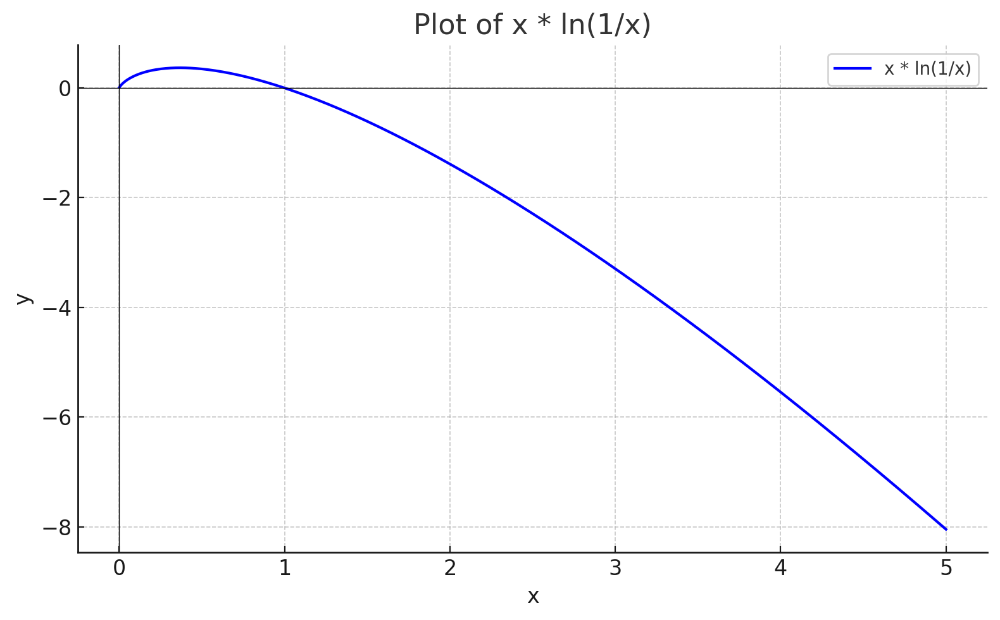

### Open Interest Fee Griefing via Delays

In escalation games, participants can exploit the system by deliberately staking on the incorrect outcome to delay resolution. Since the oracle (e.g., Artic Tern) charges a time-based fee to secure open interest, prolonging the resolution increases the total fees collected - potentially to the griefer's advantage.

Assume we have a function `griefTime(griefingCost)` that tells us how much delay a griefer can buy by losing the given amount of funds. In systems like Augur V2 or The Isonzo Front, the most effective griefing strategy involves staking on both sides of the dispute. This allows the griefer to recover most of the capital, losing only the 20% burn applied to the staked amount. (Note: the opportunity cost of locked funds is ignored in this analysis.)

If the protocol charges a time-based fee of `Open Interest Fee%`, which is fully distributed to $REP$ holders, we can compute the total cost to open interest participants for a given delay period (`TimeDelta`) as:

```math
\text{Delta Market Fees} = \text{Time Delta}\cdot \text{Open Interest Fee\%} \cdot \text{Single Market Open Interest}
```

Lets assume a griefer holds `GrieferShare%` amount of all the REP. This means the griefer can make money by delaying the market resolution:

```math
\text{Griefer Revenue} = griefTime(\text{Griefing Cost})\cdot \text{Open Interest Fee\%} \cdot \text{Single Market Open Interest} \cdot \text{Griefer Share \%}
```

We can then calculate the profit:
```math
\text{Griefer Profit} = \text{Griefer Revenue} - \text{Griefing Cost}
```

And this is a good way to attack the system if the attack is profitable: $\text{Griefer Profit} > 0$.


## Conducting the attack in The Isonso Front escalation game

In [The Isonzo Front](/The%20Isonzo%20Front.md), a griefer can perform the attack by staking on both sides of the dispute. This requires paying double the Attrition Cost, but since 80% of the staked amount is refunded, the actual cost is 20% of the staked amount:

```math
\begin{aligned}
\text{Griefing Cost} &=& &2 \cdot \text{Attrition Cost} \cdot 0.2\\
&=& &0.4 \cdot \text{Attrition Cost}
\end{aligned}
```

We can then get equation for converting AttritionCost to Griefing Cost:
```math
\text{Attrition Cost} =  2.5 \cdot \text{Griefing Cost}
```

And Assign it to the time function of The Isonso Front:
```math
griefTime(\text{Griefing Cost}) = \text{Time Limit} \cdot \frac{\ln \left( \frac{2.5 \cdot \text{Griefing Cost}}{\text{Start Deposit}} \right)}{\ln \left( \frac{\text{Fork Threshold}}{\text{Start Deposit}} \right)}
```

We can then place there to profit equation:
```math
\text{Griefer Profit} = \text{Time Limit} \cdot \frac{\ln \left( \frac{2.5 \cdot \text{Griefing Cost}}{\text{Start Deposit}} \right)}{\ln \left( \frac{\text{Fork Threshold}}{\text{Start Deposit}} \right)}\cdot \text{Open Interest Fee\%} \cdot \text{Single Market Open Interest} \cdot \text{Griefer Share \%} - \text{Griefing Cost}
```

Let's simplify this by denoting our constant string with a single variable:
```math
\text{Market Constants} = \text{Time Limit} \cdot \text{Open Interest Fee\%} \cdot \text{Single Market Open Interest} \cdot \text{Griefer Share \%} 
```

To get a bit sorter equation:
```math
\text{Griefer Profit} = \text{Market Constants} \cdot \frac{\ln \left( \frac{2.5 \cdot \text{Griefing Cost}}{\text{Start Deposit}} \right)}{\ln \left( \frac{\text{Fork Threshold}}{\text{Start Deposit}} \right)} - \text{Griefing Cost}
```

We can then find then compute the best Griefing Cost that results in the highest profit:

```math
\text{Griefing Cost} = \frac{\text{Market Constants}}{\ln\left( \frac{\text{Fork Threshold}}{\text{Start Deposit}} \right)}
```

And the max profit the griefer can get is:
```math
\text{Griefer Profit}= \frac{\text{Market Constants}}{\ln \left( \frac{\text{Fork Threshold}}{\text{Start Deposit}} \right)} \cdot \left[ \ln \left( \frac{5 \cdot \text{Market Constants}}{2\cdot\text{Start Deposit} \cdot \ln \left( \frac{\text{Fork Threshold}}{\text{Start Deposit}} \right)} \right) - 1 \right]
```
### When The attack is profitable?

The griefer is profitable when 

```math
\ln \left( \frac{5 \cdot \text{Time Limit} \cdot \text{Open Interest Fee\%} \cdot \text{Single Market Open Interest} \cdot \text{Griefer Share \%} }{2\cdot\text{Start Deposit} \cdot \ln \left( \frac{\text{Fork Threshold}}{\text{Start Deposit}} \right)} \right) > 1
```

Which can be simplified a bit to:
```math
\frac{
	5 \cdot \text{Time Limit} \cdot \text{Open Interest Fee\%} \cdot \text{Single Market Open Interest} \cdot \text{Griefer Share \%}
}{
	2 \cdot \text{Start Deposit} \cdot \ln \left( \frac{\text{Fork Threshold}}{\text{Start Deposit}} \right)
} > e
```

What we can see from the equation, is that `Time Limit` should be as small as possible and 

```math
\text{Start Deposit} \cdot \ln\left( \frac{\text{Fork Threshold}}{\text{Start Deposit}}\right)
```

should be as big as possible to minimize the attackers profit. This function is maximized when 

```math
\text{Start Deposit} = \frac{\text{Fork Threshold}}{e}
```

Which is not really a number we like to be seeing, as that would mean that start deposit should be very huge, and that it probably unreasonable. Here's the plot where $\text{Fork Threshold}$ is set to $1$:



What we can see from the image as well that the bigger the Start Deposit we have, the better, up until the maximal point.

## Forking Treshold

Whats also interesting in the profit equation, that Fork treshold is competing against Single Market Open interest, The fork treshold is in general set as some fraction of total $REP$ market cap, and total $REP$ market cap is tried to maintain as higher than Total Open Interest with some multiplier.

Let's assume the worst case, that $\text{Single Market Open Interest} = \text{Open Interest}$ and then 
```math
\text{Fork Threshold} = \text{Fork Fraction} \cdot \text{Open Interest} \cdot \text{Security Multiplier}
```
and
```math
\text{Start Deposit} = \text{Start Fraction} \cdot \text{Open Interest} \cdot \text{Security Multiplier}
```

Let's assign these to the equation to get:

```math
\frac{
	\text{Time Limit} \cdot \text{Open Interest Fee\%} \cdot \text{Griefer Share \%}
}{
	\text{Start Fraction} \cdot \text{Security Multiplier} \cdot \ln \left( \frac{\text{Fork Fraction}}{\text{Start Fraction}} \right)
} > \frac{2}{5}e
```

What we can learn from this is:
1) The longer the game lasts, the worse it is and if we remove the escalation game: `Time Limit = 0`, the griefer cannot profit.
2) The bigger the Open Tnterest Fee is, the more likely attacker is profitable 
3) The Start Fraction should be as big as possible (higher starting to cost to dispute the system). The best is $\frac{\text{Fork Fraction}}{e}.$
4) The more $REP$ the griefer holds, the worse it is as they can extract more fees.
5) At what monetary stake the fork happens (Fork Fraction) has no impact, it's only about the fraction between fork and start which matters, as this dictactes the growth speed of the exponential function in The Isonzo Front.

## Number Example
Let's try with example numbers:
| Parameter      | Value   |
| -------------- | ------- |
| Security Multiplier  | 5  |
| Griefer Share%  | 100%  |
| Open Interest Fee (yeary) | 1%  |
| Time Limit     | 7 weeks |
| Number Of Weeks In a Year     | 52 weeks |
| Start Fraction | 0.4 REP / 11 000 000 REP  |
| Fork Fraction | 275 000 REP / 11 000 000 REP  |

```math
\frac{
	7 / 52  \cdot 0.01  \cdot 1
}{
	0.4/11000000 \cdot 5 \cdot \ln \left( \frac{\text{275000/ 11000000}}{0.4/11000000} \right)
} > \frac{2}{5}e
```

Which results in $550.85 > 2/5e$, which means the attack is successful and the attacker can delay the system and extract profit.

If we use the same numbers, but set the `Griefer Share% = x`, and solve for x, we get that the griefer should hold at least `0.1974%` of all $REP$ to be profitable.

With all reasonable numbers, it appears that the $REP$ holders should always the delay the system if the Open Interest Fee is enough to cover the costs. The bad thing about this, is that **all** markets get delayed by short term profit motivated $REP$ holders. One could argue that it's against the incentive of $REP$ holders to grief the cash cow (open interest holders), which is probably true, but even relatively small holders of $REP$ should delay the system for profit.
