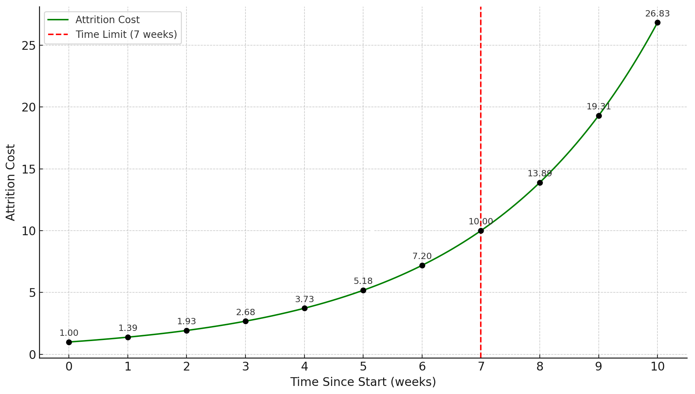

# The Isonzo Front - Escalation Game


The Isonzo Front refers to a series of twelve grueling battles between the Austro-Hungarian and Italian armies during World War I, primarily fought along the Isonzo River. These took place between June 1915 and November 1917, mostly on the territory of present-day Slovenia and partially in Italy. The campaign was marked by attrition, repetition, and a constant escalation of costs and effort.

Inspired by this historical metaphor, *The Isonzo Front* is an escalation game model designed to address two major issues in oracle-based escalation mechanisms:

1. Ensure that the costs and potential rewards of participation are as predictable as possible for all parties.
2. Limit the capital requirements for honest reporters.

In Augur V2, the escalation mechanism has a key vulnerability: attackers can create many conflicting markets and dispute all of them. This ties up the capital of honest participants across multiple markets, meaning that defenders must collectively possess more capital than the attackers to maintain oracle integrity.

This leads us to a central question:
Can we design an escalation game that reduces the capital burden on honest reporters while still ensuring system integrity?

The first attempt to solve this problem was the [Combinatorial Escalation Game](./Combinatorial%20Escalation%20Game.md), which reduce the required honest capital to the total cost of a single escalation game. However, it introduced other significant issues, such as:

* Uncertainty in potential profits for participants
* Severe griefing vectors that could be exploited to disrupt resolution

*The Isonzo Front* addresses these shortcomings with two core design features:

1. A **[War of Attrition](https://en.wikipedia.org/wiki/War_of_attrition_(game))**-style escalation mechanism: *A Battle of Isonzo*
2. A **priority queue** that:
   * Prioritizes resolution of the most important markets
   * Freezes lower-priority markets once a predefined capital threshold is reached

## A Battle of Isonzo
A *Battle of Isonzo* represents a single escalation game within the system. Each battle concludes with one of the following outcomes: `INVALID`, `YES`, `NO`, or `FORK`.

The battle begins when the designated reporter submits an initial `Start Deposit` in $REP$ tokens. This triggers a 1-week resolution timer. If no one disputes the market during this period, the outcome proposed by the reporter is finalized.

However, the battle can be escalated by any participant who deposits more than the current total on the leading outcome

Once a battle is active, anyone may deposit $REP$ on any side. The game functions as a war of attrition: escalating the battle becomes increasingly expensive over time. The cost to participate grows exponentially, following this formula:

```math
\text{Attrition Cost} = \text{Start Deposit} \cdot \left( \frac{\text{Fork Threshold}}{\text{Start Deposit}} \right)^{\frac{\text{Time Since Start}}{\text{Time Limit}}}
```

### Starting Parameters
| Parameter      | Value   |
| -------------- | ------- |
| Start Deposit  | 1 REP   |
| Fork Threshold | 10 REP  |
| Time Limit     | 7 weeks |

We get following cumulative cost to stay in the battle given each week:

If, at any point in time, only one side has successfully paid the attrition cost, the battle ends and that outcome is finalized.

Alternatively, the battle ends in a `FORK` if **two or more sides** each manage to deposit the full `Fork Threshold` amount. In this case, the market enters a fork, allowing the creation of separate universes. Notably, **it is not possible** to deposit more than the `Fork Threshold` on any single side.

### Solving for Resolution Timing

To estimate how much capital is required to push a resolution by a specific time, we can solve for `Time Since Start` in the attrition cost equation. This helps participants plan their capital commitments strategically:

```math
\boxed{
\text{Time Since Start} = \text{Time Limit} \cdot \frac{\ln \left( \frac{\text{Attrition Cost}}{\text{Start Deposit}} \right)}{\ln \left( \frac{\text{Fork Threshold}}{\text{Start Deposit}} \right)}
}
```

### Late Entry into a Battle

An interesting feature of the system is that participants can join an ongoing battle at any time. For example, if `YES` and `NO` are actively competing, the `INVALID` side can still enter later by depositing the required attrition cost at that point in time.

In other words, **it is not necessary to be part of the battle from the beginning** - but joining later requires paying the full cumulative cost up to that moment.

### Rewards and Settlement
When a battle ends:
* The winning side receives twice the amount of their Binding Stake. The non-binding stake is returned as it is.
* In the case of a `FORK`, each winning side in the forked universes is rewarded accordingly.
* Losing sides lose all their invested capital

**Binding Stake** refers to the amount of funds that were:
* Deposited during the battle
* Matched by at least one opposing side

If three sides are involved (e.g., `YES`, `NO`, `INVALID`), and one side loses, the losing side’s funds are burned. This mechanism ensures that winners are always rewarded with a 2x return on their matched stake.

Optionally, a portion of the winning side's stake can also be burned to discourage griefing. For example, Augur V2 burns 10% of the deposit to impose a small cost on participation and limit risk-free trolling.

> [!NOTE]
>
> #### Example Gameplay
>
> 1. Bob reports a market outcome as `YES` and stakes 1 $REP$ as the starting deposit. This initiates the game, and the market is set to resolve in 1 week if undisputed.
>
> 2. After 1 day, Alice sees the market and believes the correct outcome is `NO`. To dispute, she must stake more than 1 $REP$ on `NO`. She chooses to stake 3 $REP$.
>
>	* This updates the attrition cost and increases the timer to approximately: $t = 7 \cdot \frac{\ln(3)}{\ln(10)} ≈ 3.34 \text{ weeks}$
>
> 3. No one disputes Alice’s `NO` stake over the next 6 days, so the battle ends with the outcome `NO`.
>
> 4. As the winner, Alice can claim 1 $REP$ from Bob (her opposing matched stake), resulting in a net gain of 1 $REP$.

## Capping the Capital

The Battle of Isonzo still shares a core vulnerability with Augur V2:
An attacker can initiate multiple disputes across many markets simultaneously. Unless honest participants have enough capital to defend all of them, attackers can overwhelm the system.

To address this, The Isonzo Front introduces a priority queue and a global capital cap.

### Freeze Threshold

Under normal conditions, The Isonzo Front behaves similarly to Augur V2 - multiple escalation games can run in parallel. However, once the total binding capital across all active battles exceeds a predefined Freeze Threshold, the system enters a special Freezing State.

For example, the Freeze Threshold can be defined as:

```math
\text{Freeze Threshold} = 3 \cdot \text{Fork Threshold}
```

### Freezing State Behavior

When the system enters the Freezing State:

* The top three markets (by binding capital) are selected.
* These markets become immune to freezing for the rest of their lifecycle.
* All other markets are frozen.

Frozen markets can still receive new stakes, but their Attrition Cost remains fixed (i.e., does not increase with time) while the system is in the Freezing State.

### Exiting the Freezing State

The system exits the Freezing State once the total binding capital drops below the Freeze Threshold. After exiting:
* All frozen markets resume normal attrition behavior.
* Markets that were granted immunity remain permanently immune.
* If a new freeze occurs and fewer than three markets are currently immune, new ones are added from the priority queue until the three-slot immunity is filled again.

### Worst-Case Capital Requirement for the Honest Side

In the worst case, attackers create as many markets as possible and submit incorrect reports via designated reporters. The honest side is then forced to defend all these markets, which maximizes their capital requirements.

Before the system enters the Freezing State, the maximum number of active, disputed markets is:

```math
\text{Number of Disputed Markets} = \left\lfloor \frac{\text{Freeze Threshold}}{\text{Start Deposit}} \right\rfloor
```

Adding one more market at this point will push the system into Freezing State.

After the system freezes:
* The top three markets (by binding capital) become immune.
* Honest participants only need to defend these three, up to the Fork Threshold.

Thus, the worst-case capital requirement for the honest side is:

```math
\text{Worst Capital Requirement} = \text{Freeze Threshold} + \text{Start Deposit} + \text{Number of Immune Markets} \cdot (\text{Fork Threshold} - \text{Start Deposit})
```

Assuming:

* `Freeze Threshold = 3 × Fork Threshold`
* `Number of Immune Markets = 3`

Then:

```math
\text{Worst Capital Requirement} = 6 \cdot \text{Fork Threshold} - 2 \cdot \text{Start Deposit}
```

This is a reasonably bounded and predictable worst-case scenario, and a significant improvement over systems like Augur V2.

### Practical Worst Case

Despite this theoretical bound, practical capital requirements may be higher due to stake lock-up. If honest stakers commit funds to markets that later get frozen and don't progress, that capital is stuck without increasing attrition cost-effectively wasting resources.

To mitigate this, one possible improvement is to allow users to withdraw non-binding capital from frozen markets (i.e., funds not currently matched by an opposing side).

### Ongoing Capital Commitments

Honest stakers must always ensure they have at least a tiny edge in each battle to guarantee correct resolution. In practice, it may be wise to maintain one week's worth of attrition capital on each active market, so that they only need to check and reinforce their positions once per week.

## Reward for Prestaking

In closely contested battles, it can be risky for defenders to wait until the timer is nearly expired. An attacker might stake just enough additional capital at the last moment to tip the outcome in their favor - leaving defenders with no time to respond.

To mitigate this risk, defenders must ideally maintain a buffer of capital on their side, ensuring they have enough time to react if the balance shifts. However, when both sides are nearly tied, there's little incentive for users to contribute more capital, since overflow capital (i.e., unmatched excess stake) does not earn additional rewards.

### Incentivizing Defensive Buffers

To solve this, the system can be designed to reward prestaking, by allowing a portion of the attacker's stake to be redistributed to early or buffered defenders. For example, we could reward one week's worth of prestaked capital from the attacker's pool if the defender side wins.

This ensures:
* Defenders have an incentive to stake early and maintain a buffer.
* Even if the attacker never closes the gap, defenders are compensated for their proactive commitment.
* There's always at least one week of decision time before attackers can potentially flip the market unopposed.

## Summary of Benefits

The Isonzo Front improves upon the Augur V2 escalation game with several key enhancements:

1. **Supports Prestaking**
   Participants can stake early to avoid stake sniping and signal more clearly on how much capital is ready to defend.

2. **Caps Total Capital Requirement**
   By introducing a Freeze Threshold and prioritization mechanism, the system limits how much honest participants need to stake.

3. **Enables Instant Forking**
   If sufficient capital is committed, the system can fork immediately without delay, ensuring fast resolution for high-stakes disputes.

4. **Provides Flexible Participation**
   Even small capital contributions extend the timer.

5. **Predictable Escalation Curve**
   The capital required to extend the timer is easy to calculate and independent of other parties' behavior, making planning straightforward.

6. **Fairer Game Dynamics**
   The system ensures that the winning side only needs to lock slightly more capital than the losing side - promoting balance and fairness.

Here's Solidity pseudo code for the The Isonzo Front: [contracts/TheIsonzoFront.sol](./contracts/TheIsonzoFront.sol).
