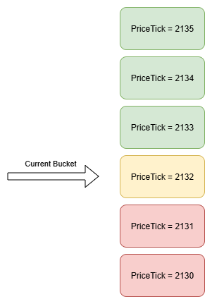

# Thousand Needles - A Mass Bleed Liquidator

Thousand Needles is a mechanism that enables a single keeper to efficiently monitor and trigger liquidations across all Security Pools based on price-driven health factor changes. Instead of requiring multiple keepers or per-pool monitoring, this approach centralizes liquidation triggers into a single price-based system, which can be updated manually by a keeper or automatically through an Uniswap V4 hook.

In this context, bleed liquidation refers to a gradual, time-based liquidation process. When a pool becomes undercollateralized, its collateral is slowly burned over time rather than being instantly liquidated.

For example, a bleed liquidator might impose a 5% collateral loss over a week while the pool remains undercollateralized. This approach discourages prolonged risk exposure, incentivizes timely recapitalization, and avoids sudden liquidation shocks that can harm participants.

## Health Factor

The health of a Security Pool can be measured using its **Health Factor**:

```math
\text{Health Factor} = \frac{\text{Staked REP} \cdot \text{Security Multiplier}}{\text{Security Bonds Issued} \cdot \frac{REP}{ETH}}
```

Where:

* **Health Factor ≥ 1**: The pool is safe. Higher values indicate stronger collateralization.
* **Health Factor < 1**: The pool is undercollateralized and subject to liquidation.

In this equation, the only variable that changes continuously is the price ratio $\frac{REP}{ETH}$. Other parameters remain fixed unless a pool-specific action occurs. This simplifies the formula to:

```math
\text{Health Factor} = \frac{\text{Constant}}{\frac{REP}{ETH}}
```

## Tracking Undercollateralization Duration

For a bleed liquidator, our focus shifts away from the exact health factor values and toward how long a pool has remained undercollateralized (i.e., how long its health factor has stayed below 1).

Rather than liquidating an unhealthy pool immediately, we measure the duration of undercollateralization and apply a gradual penalty (such as burning a fixed percentage of its collateral over time). This enables lazy enforcement of liquidation penalties without constant per-block intervention or active monitoring.

Since price is the only continuously changing variable in the health factor formula, we can derive these undercollateralization periods entirely from price movements.

Instead of tracking this individually for each pool, we can introduce Price Buckets. These buckets record how long the price has remained under specific thresholds, creating a shared timeline that can be used across all pools. Any pool can then reference this data to determine how long it has been unhealthy relative to its own critical price level, without needing its own dedicated tracking mechanism.

```ts
struct Bucket {
	uint256 cumulativeTimeUnder
	uint256 enteredAt
}
```
When the price crosses a bucket boundary:
- Update every intermediate bucket’s `cumulativeTimeUnder` and `enteredAt`
- Set the `enteredAt` timestamp for the new active bucket to the current time.

If price remains within a bucket, no updates are necessary. Prices can be bucketed using Uniswap-style ticks:

```
sqrtPriceX96 = sqrt(1.0001^tick) * 2^96
```



Because liquidation monitoring does not need extremely fine-grained precision, we can use coarser tick intervals, which reduces how often ticks are crossed and makes updates cheaper in gas cost.

## Varibles need to be defined

| Parameter           | Explanation              |
| ------------------- | ------------------ |
| Daily Liquidation % | How much collateral is being burned every day for a undercollateralized Security pool            |
| Number Of ticks     | How coarce the tick grid is              |
