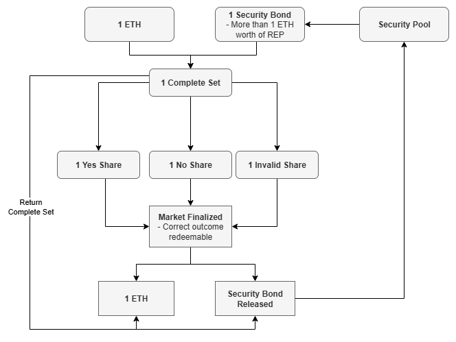
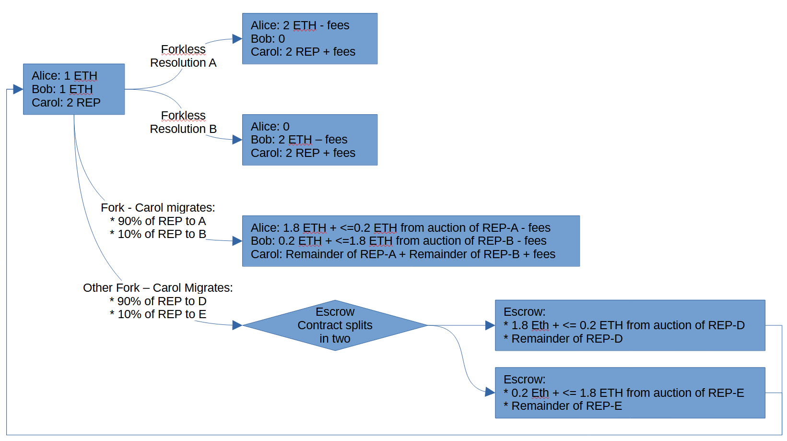

# Security Bonds Pools Layer
Security Bond Pools layer allows users to denominate their bets in various tokens while ensuring that those bets remain backed by sufficient amount of REP. By securing bets with REP, the system guarantees that outcomes are correctly resolved by the PLACEHOLDER2 oracle.

The Security Bond Pools are not part of the core of the oracle. This means that anyone can deploy a new version of the contracts, plug it to use the core and start using the new contracts. However, the users of the new conracts need to be careful and consider if the new contracts are secure and act accordingly.

In this document we describe one way to implement the Security Bond Pools and the way Dark Florist is going to implement them.

# Implementation
A single Security Bond Pool enables the end user to have their bets backed in a single external denonimation. For example, ETH Security Bond Pool allows users to deposit REP and mint Security Bonds that back 1 ETH worth of complete sets that can then be used for trading.

ETH Security Pool Implements following features:
1) **Create Security Pool**
1) **Deposit REP**: By depositing REP you can mint Security Bonds in a way that:
```math
\text{Security Bonds} < \frac{\text{Security Multiplier}\cdot\text{REP Deposit}}{\frac{REP}{ETH}}
```
2) **Mint Security Bonds**:
3) **Attach security bonds to a Core Question**
4) **Liquidate security pool**

# Security Pools

Security Pools in PLACEHOLDER are conceptually somewhat similar to MakerDAO’s Collateralized Debt Positions (CDPs). In MakerDAO, users deposit ETH as collateral to borrow DAI. In PLACEHOLDER, users deposit REP tokens as a Security Deposit and create Security Bonds backed by that REP. Each Security Bond enables its holder to deposit one ETH into PLACEHOLDER and mint one Complete Set for every pair of ETH and Security Bond.

Like MakerDAO, keepers in PLACEHOLDER monitor Security Pools (or CDPs) to ensure that the amount of debt remains manageable. The key requirement in PLACEHOLDER is:

```math
\text{Security Bonds Minted} \leq \frac{\text{Security Deposit}_{REP}}{\text{Security Multiplier} \times \text{Price}_{REP/ETH}}
```

By managing your own Security Pool with your REP tokens providing Security Bonds, you can trade on PLACEHOLDER while only incurring the cost of locked capital.



## Security Bonds
When Security Pools are used to mint Complete Sets, they generate debt measured in Security Bonds. Each Complete Set must be backed by one ETH and one Security Bond. This Security Bond debt can be cleared in three ways:

1) Returning Complete Sets for the same market back to the pool (these do not have to be the exact same Complete Sets originally minted by the Security Pool; Complete Sets minted by other Security Pools are also accepted).
2) When the market for the Complete Set ends, its associated debt is transferred to the Global Security Bond Debt.
3) Transferring your debt to another Security Pool, if that pool allows it and the transfer does not cause that pool to exceed its limits.

### Global Security Bond Debt

While Security Pools have their local limit on how much Security Bonds they can generate, PLACEHOLDER also has a global limit:

```math
\text{Total Security Bonds Minted} \leq \frac{\text{Supply}_{REP}}{\text{Security Multiplier} \times \text{Price}_{REP/ETH}}
```

Here

```math
\text{Total Security Bonds Minted} = \sum_i^{Pools} \left( \text{Security Bonds Minted}_i \right) \ + \ \text{Global Security Bond Debt}
```

When a market is finalized, it's Global Security Bond Debt is cleared.

## [Liquidating Security Pool](./Liquidation.md)

### Security Pools Controllers
While some functions within Security Pools - such as triggering liquidation - can be executed by anyone, most operations are limited to their controllers. A controller can be either a regular Ethereum address or a smart contract. Controllers are responsible for defining how complete sets are minted.

The system itself does not charge any internal fees, but controllers enable REP holders to generate revenue. Only REP holders have permission to mint complete sets through Security Pools. This exclusivity allows REP holders to monetize access to complete sets.

Possible monetization strategies include:
1) Selling complete sets directly to anyone, with prices influenced by factors like market duration, market white list, etc.
2) Selling complete sets while simultaneously buying them back to mint new ones and maintain liquidity
3) Issuing wrapped complete sets that charge a time-based fee instead of distributing sets directly

Enabling REP holders to earn revenue is crucial because the security of the system depends on maintaining an inequality ($\text{REP Market Cap} > \text{Open Interest}$). Since the system imposes no fees itself, it is up to REP holders to develop effective methods for monetizing access to complete sets.

REP holders participating in Security Pools managed by others should exercise caution. Depositing REP into a poorly managed pool can lead to loss of funds and give malicious actors the ability to misuse that REP to attack PLACEHOLDER.

### Good practices for Open Security Pools
- REP holders should be able to fork of the pool by taking their share of the open interest with them into new pool to exit the pool
- REP holders should be allowed to use their share of voting power for Escalation Game

## Parameters

| Parameter                     | Value                  |
| ----------------------------- | ---------------------- |
| Security Parameter            | 2                      |


## Todo
- We probably need some limit on how small pools can be (both REP and OI side), eg Maker's CDP's have limit for these to allow liquidators to be profitable



