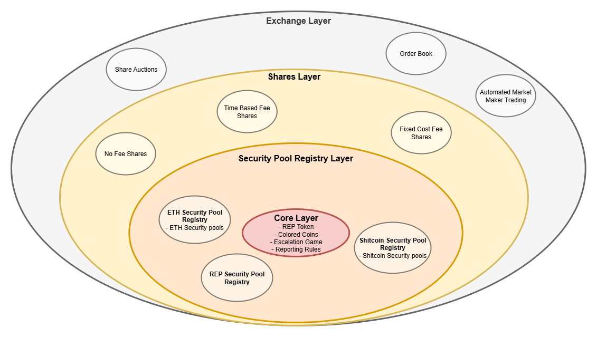

# PLACEHOLDER2 - a Decentralized Oracle and Prediction Market Platform

PLACEHOLDER2 is a game-theoretically secure, censorship-resistant oracle and prediction market protocol built on Ethereum. It allows users to create, trade, and resolve prediction markets while aligning incentives toward accurate reporting of real-world outcomes.

PLACEHOLDER2 is built on the Augurs2 design idea: If there's disagreement about how a market should resolve, Augur splits into two chains. Users are expected to follow the chain that reflects the "truth," and that version retains its value.



PLACEHOLDER2 is built with multiple layers: 
1) **Core Layer**: A feeless Colored Coins system with an Escalation Game. The Core Layer enables users to submit questions to the PLACEHOLDER2 oracle. The oracle can respond with one of three outcomes - YES, NO, or INVALID - or, if there is disagreement, trigger a fork of the REP token to resolve the question in the forked universe.
2) **Seurity Bonds Pools Layer**: Converts the REP backed bets into backed by any other token, eg, ETH/USDC or any untrusted shitcoins.
3) **Shares Layer**: Enables REP holders to sell their share of PLACEHOLDER2’s security to traders through customizable fee structures.
4) **Exchange Layer**: Provides a marketplace where traders can buy and sell shares, as well as place bets on real-world events, using tokens and fee structures defined by the market.

# Core Layer
The core consists of a Colored Coin system and an Escalation Game system.

The *Colored Coins* system refers to a distinct oracle mechanism, with the earliest mention appears in a brief reference by [zack-bitcoin](https://github.com/zack-bitcoin) in the [Amoveo documentation](https://github.com/zack-bitcoin/amoveo-docs/blob/master/design/oracle_simple.md). This design is entirely separate from the concept of [Colored Coins on Bitcoin](https://en.bitcoin.it/wiki/Colored_Coins), which involves tagging bitcoins to represent alternative assets on the Bitcoin blockchain.

Amoveo describes the oracle system as follows:

> A simple way to do the oracle is like this: Every time a decision resolves, the blockchain forks. One side decides that the decision's outcome is "true", the other decides "false". Users know the truth. They prefer the chain that is more honest. So the coins on the honest chain are the ones that are valuable. So miners are only able to profitably mine on the honest chain.

The core concept of Colored Coins can be summarized as:

> Each time the system encounters a decision, the chain of decisions splits-each possible outcome unfolding in its own branch. These branches can then continue to fork with every subsequent decision.

PLACEHOLDER2 implements the same system using REP token than splits decisions. However, not every decisions will trigger a fork. An escalation game system is used to prevent disruptive forks.

## Colored Coin never resolves the markets
A key implication of this design is that the system never definitively resolves decisions. From the perspective of an outside observer, there is no single "correct" outcome-since all outcomes exist simultaneously on their respective branches. This makes the system fundamentally different to other decentralized oracles (e.g., [Augur V2](https://github.com/AugurProject/whitepaper/releases/latest/download/augur-whitepaper-v2.pdf) or [UMA](https://uma.xyz/)), which are vulnerable to parasitic interest attacks. In contrast, the Colored Coins approach mitigates this issue by not finalizing any single resolution, making it impossible to extract value without engaging directly in the system.

Some may argue that this mechanism doesn't constitute a true oracle-since it never produces a final, canonical answer-but in the context of a prediction market, a definitive oracle isn't always necessary.

In this model, users can freely trade within a chosen branch (also called "chain" or "universe" in this article). When the market forks due to a decision, each participant can independently select the branch they consider to represent the correct outcome and continue trading within that context.

> [!NOTE]
> ### Example: Universe Forking in Practice
> 
> Assume we have two prediction market traders, **Bob** And **Alice**. The traders are trading with colored coins denotiated with $REP$.
> 
> 1. **Bob** holds 100 YES shares in the market.
> 2. **Alice** holds 100 NO shares in the same market.
> 3. When the market reaches its resolution point, the current universe forks into two new universes: one where the outcome is **YES**, and another where it is **NO**.
> 4. In the **YES universe**, Bob can redeem his 100 YES shares for 100 units of a universe-specific asset, denoted as $REP_{YES}$. In this universe, Alice's NO shares are worthless (0 $REP_{YES}$).
> 5. In the **NO universe**, Alice can redeem her 100 NO shares for 100 $REP_{NO}$. In this universe, Bob's YES shares hold no value (0 $REP_{NO}$).
> 6. Despite losing in the YES universe, Bob might personally believe the NO outcome is correct. As a result, he chooses to continue trading in the **NO universe**.
> 7. Alice also believes the NO universe is correct and continues trading there as well.
> 
> However, this isn’t always the case. Steps 6 and 7 could unfold differently if the participants disagree. For example, Bob might stay in the YES universe while Alice stays in the NO universe.

> So for an honest oracle the question of "Is it raining in Berlin" is kind of the same as the question "Should we say it's raining in Berlin" - Edmund Edgar

## Truthful universe should retain significant portion of the economic activity

After a market has forked, if enough users support each branch, both universes can retain economic activity and remain valuable, potentially becoming the basis for future markets independently. The system considers all the future universes equally and internally has no information about the truthfulness of the universes. We can assume that at the time of the fork, the value of the assets prior to the fork equal the value of the assets after the fork (across all universes):

```math
\boxed{
	value\;of\;assets\;prior\;fork = \sum_{future\;universes}{value\;of\;assets_{universe}}
}
```

We also need to assume that:
```math
\boxed{
	value\;of\;assets\;prior\;fork ≈ value\;of\;assets_{truthful\;universe}
}
```
We can then deduce that this must mean that the value of dishonest universes need to be approximately 0:
```math
\sum_{dishonest\;universes}{value\;of\;assets_{universe}} ≈ 0
```
If these assumptions hold, traders are incentivized to align their trades with the truth, as only the true outcome captures all the value when the market resolves. Otherwise, traders may be biased against the actual value distribution, since multiple outcome branches can each retain non-zero value at resolution.

> [!NOTE]
> ### Example: Split Beliefs
> 
> **Alice** is trading on a prediction market for the question: *"Who will be the leader of OrangeLand in 2025?"* The market currently has equal-priced limit orders, implying a 50%-50% probability split between **Leader Bob** and **Majesty Mallory**.
> 
> Due to ongoing political turmoil in OrangeLand, Alice believes the country will fracture into two factions, each recognizing a different leader as legitimate. She estimates that 20% of the country will recognize **Leader Bob**, while 80% will support **Majesty Mallory**.
> 
> From Alice’s perspective, the correct valuation of the options should reflect this split: the **Leader Bob** contract should be priced at 20%, and the **Majesty Mallory** contract at 80%. However, since the market currently prices both at 50%, Alice sees a profitable opportunity. She can buy **Leader Bob** shares, which she believes are undervalued, and sell or avoid **Majesty Mallory** shares, which she believes are overvalued. If her belief about the split future is correct, her **Leader Bob** shares will effectively be worth 80% of their current market value, generating a significant profit.

## Acquiring Colored Coins

Obtaining colored coins can be challenging, as the system lacks a built-in mechanism to mint new coins on demand. Currently, there are a few ways to acquire them:

1. **Initial Distribution**: When the system is first launches, colored coins can be distributed to users.
2. **Secondary Market**: Once the system is operational, existing holders may sell their coins to new users in exchange for other assets.
3. **Market Winnings**: In the prediction markets, winners receive colored coins from the losing side of bets.

If a reliable internal method is established to assess the value of colored coins, the system could introduce a mint-and-burn mechanism-minting new coins backed by valuable assets, and later buying them back using the same assets.

One possible implementation this would be periodic auctions, where a fixed amount of colored coins is auctioned in exchange for a predefined asset considered valuable at the system’s launch. In parallel, a reverse auction could be held where users exchange those assets back for colored coins, helping to establish and reinforce their internal value.

> [!WARNING]
> TODO: Analyze these distribution methods more

## All assets need to be forkable

The Colored Coins system requires the asset that markets are denominated in to be natively splittable across forks, which prevents the direct use of external assets like Ether, Bitcoin, or fiat-backed stablecoins. As a result, participants must trade using assets issued and governed entirely within the system.

This is a major limitation. Each deployment must create its own internal currencies, which are the only tradable assets. Consequently, liquidity and price stability are often weaker than they would be if widely recognized external assets were supported.

The **Partial Colored Coins** system is a proposed solution to this limitation. It aims to enable trading using external assets while preserving the core branching mechanism of the Colored Coins model.

## What Makes Colored Coins Valuable?

The Colored Coins system does not impose any fees to its users, so the coins do not derive value from generating profit for their holders. Instead, their value comes from the permission they grant: holding colored coins allows users to participate in trustless prediction markets. Users without colored coins must acquire them (as discussed earlier) in order to take part.

This logic also explains why *truthful* colored coins hold value, while *dishonest* ones do not. Prediction markets only function properly when participants are incentivized to make honest predictions. If dishonest outcomes were valuable, the markets would lose their purpose. Therefore, the system relies on the value of colored coins being tied to truthful participation.

Importantly, Colored Coins avoid the "Ouroboros Problem"-a flaw common in pyramid or Ponzi schemes -- where value depends on attracting new investors to pay returns to earlier ones. Instead, the value of Colored Coins is sustained by the actual use of the platform, not by the influx of new capital.

### Volatility of Colored Coins
The value of colored coins is highly volatile, as it is only tied to the utility and activity within the prediction market platform. When platform usage increases-especially during periods with engaging or high-interest markets-the demand for colored coins can tend to rise, pushing their value up. Conversely, when activity slows down or markets are less appealing, their value can drop.

> [!NOTE]
> #### Example: Predicting with volatile coins
> Suppose one colored coin is worth $5. You place a successful bet and double your colored coin balance from 1 COINS to 2 COINS. However, during that time, the value of each colored coin drops to $2.50. Despite winning the bet, your total value remains $5, meaning you made no real gain.

Traders in the colored coins system must account for potential fluctuations in the coin's value over time. A trader who believes the value of colored coins will rise might opt to simply buy and hold them, rather than engaging in prediction markets. If the value does increase, they can later sell the coins for a profit.

However, this volatility introduces a strategic vulnerability. If a trader believes the platform's currency is overvalued, they should avoid participating in prediction markets. Instead, the rational move would be to sell their holdings, wait for the currency to reach a more reasonable valuation, and only then re-engage with the platform. Conversely, if the colored coins are undervalued, the trader should consider buying them and possibly participating in prediction markets to amplify potential gains.

An efficient shorting mechanism for colored coins could add significant value by enabling traders to profit from both upward and downward price movements, while also helping to keep the asset's value within a more reasonable range.

If the Colored Coins system is treated purely as a game, without attaching financial value to the coins, volatility becomes irrelevant. In this context, players may care only about the number of colored coins they hold in the correct universe-not their value relative to any external asset.

## Assumptions of colored coins

To sum it up, in order for the Colored Coins system to be secure, we need to assume the following: 

1. **Users are greedy**: Users value more money over less money.
2. **A fork doesn't change the total value of the system**. Market cap of a previous universe equals to market cap of the formed universes: 
```math
\text{value of assets prior fork }= \sum_{\text{future universes}}{\text{value of assets}_{universe}}
```
3. **Users value honest universe(s)**: User prefers to use an universe that is honest in their opinion:
```math
\text{value of assets prior fork } = \text{value of assets}_{\text{truthful universe}}
```
4. **Neglible operation costs**: Transaction fees (eg, gas fee) are neglible compared to financial value of the transactions.
5. **Access to information**: Users should have reliable and timely access to information in order to determine the most truthful outcome of a market.
6. **Colored Coins are not too volatile**: If the coins are too volatile, it makes no sense to bet with them.
7. **Traders can handle some extra volatility**: Users are okay to trade only with volatile tokens.
8. **Migrating is not too hard**: Users, exchanges and other tools using the systems are okay to migrate into fork they believe is truthful.


## [Escalation Game](Escalation%20Game.md)
