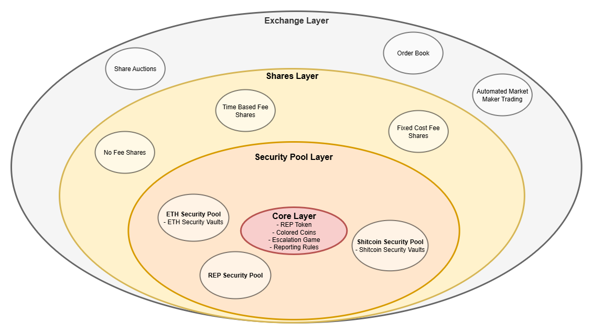

# PLACEHOLDER2 - a Decentralized Oracle and Prediction Market Platform

PLACEHOLDER2 is built with multiple layers. At its core is the Colored Coins system, combined with an Escalation game. Each additional layer extends this foundation. Upgrades are trustless and open - anyone can deploy a new contract, and once deployed, it can be used alongside all previous contract versions.

The PLACEHOLDER2 core allows betting only with REP tokens. To enable betting with other tokens, Token Security Bond Pools come in the play, which is the next layer. The above layers then again plug into this layer to continue building financial derivates on top of the core.

# Core Layer
The core consists of a colored coin system and an escalation game.

The *Colored Coins* system refers to a distinct oracle mechanism, with the earliest mention appears in a brief reference by [zack-bitcoin](https://github.com/zack-bitcoin) in the [Amoveo documentation](https://github.com/zack-bitcoin/amoveo-docs/blob/master/design/oracle_simple.md). This design is entirely separate from the concept of [Colored Coins on Bitcoin](https://en.bitcoin.it/wiki/Colored_Coins), which involves tagging bitcoins to represent alternative assets on the Bitcoin blockchain.

Amoveo describes the oracle system as follows:

> A simple way to do the oracle is like this: Every time a decision resolves, the blockchain forks. One side decides that the decision's outcome is "true", the other decides "false". Users know the truth. They prefer the chain that is more honest. So the coins on the honest chain are the ones that are valuable. So miners are only able to profitably mine on the honest chain.

The core concept of Colored Coins can be summarized as:

> Each time the system encounters a decision, the chain of decisions splits-each possible outcome unfolding in its own branch. These branches can then continue to fork with every subsequent decision.

PLACEHOLDER2 implements the same system using REP token than splits decisions. However, not every decisions will trigger a fork. An escalation game system is used to prevent disruptive forks.

## [Escalation Game](Escalation%20Game.md)
