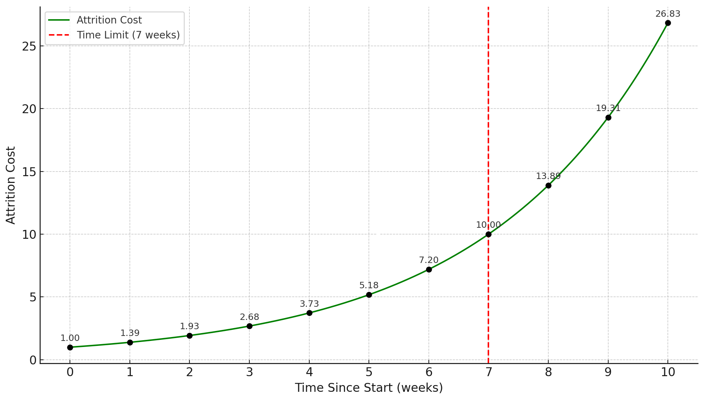

# Escalation Game
[TODO, should we handle the OI fees somehow(?), as we don't know what they are nowadays]

Escalation Game is a [War of Attrition](https://en.wikipedia.org/wiki/War_of_attrition_(game)) kind of game where three different potential market resolution outcomes (Invalid, Yes, No) stake REP on each respective side. REP holders can choose to participate on any side of the battle and even participate on multiple sides. The Escalation game ends with one of the following outcomes: `INVALID`, `YES`, `NO`, or `FORK`.

The game starts if someone stakes more than **Market Creator Bond** on a different outcome than Initial Reporter/Designated Reporer reported on before **Dispute Period Length** runs out. If this doesn't happen during the time period the outcome proposed by the reporter is finalized.

If the market is disputed, the battle becomes active. Once a battle is active, anyone may deposit $REP$ on any side. The game functions as a war of attrition: escalating the battle becomes increasingly expensive over time. The cost to participate grows exponentially, following this formula:

```math
\text{Attrition Cost} = \text{Market Creator Bond} \cdot \left( \frac{\text{Fork Threshold}}{\text{Market Creator Bond}} \right)^{\frac{\text{Time Since Start}}{\text{Escalation Game Time Limit}}}
```

[todo: we probably want to use the attrition cost from dual escalation game (steeper start that depends on the escalated markets OI)]
[todo: add a mechanism to control how steep the curve is at start depending on how much games are often escalated, weighted by the markets OI and time]

## Cost to Stay in game
We get following cumulative cost to stay in the battle given each week:
 (if $\text{Market Creator Bond} = 1$ REP, $\text{Fork Threshold} = 10$ REP $\text{Escalation Game Time Limit} = 7$ weeks)
If, at any point in time, only one side has successfully paid the attrition cost, the battle ends and that outcome is finalized.

Alternatively, the battle ends in a fork if **two or more sides** each manage to deposit the full `Fork Threshold` amount of REP. In this case, PLACEHOLDER forks, allowing the creation of separate universes. Notably, **it is not possible** to deposit more than the `Fork Threshold` on any single side.

### Solving for Resolution Timing

To estimate how much capital is required to push a resolution by a specific time, we can solve for `Time Since Start` in the attrition cost equation. This helps participants plan their capital commitments strategically:

```math
\boxed{
\text{Time Since Start} = \text{Time Limit} \cdot \frac{\ln \left( \frac{\text{Attrition Cost}}{\text{Start Deposit}} \right)}{\ln \left( \frac{\text{Fork Threshold}}{\text{Start Deposit}} \right)}
}
```

### Late Entry into a Battle

An interesting feature of the system is that participants can join an ongoing battle at any time. For example, if `YES` and `NO` are actively competing, the `INVALID` side can still enter later by depositing the required attrition cost at that point in time.

In other words, **it is not necessary to be part of the battle from the beginning** - but joining later requires paying the full cumulative cost up to that moment.

### Rewards and Settlement
When a battle ends:
* The winning side receives their contributed stake back and all the REP staked by the second most staked side.
* In the case of a fork, each winning side in the forked universes is rewarded accordingly.
* Losing sides lose all their invested capital

The winning side is rewarded in order of time of contribution to the game. All the Binding Stake and 20% pre-staked over (**Binding Stake** refers to the amount of funds that were, deposited during the battle and Matched by at least one opposing side), is rewarded all the losing sides REP minus 20%, which is burnt.

If all three sides are involved in the battle (`YES`, `NO`, `INVALID`), and one side loses, the losing side’s funds are burned.

> [!NOTE]
>
> #### Example Gameplay
>
> 1. Bob reports a market outcome as `YES` and stakes 1 $REP$ as the starting deposit. This initiates the game, and the market is set to resolve in 1 week if undisputed.
>
> 2. After 1 day, Alice sees the market and believes the correct outcome is `NO`. To dispute, she must stake more than 1 $REP$ on `NO`. She chooses to stake 3 $REP$.
>
>	* This updates the attrition cost and increases the timer to approximately: $t = 7 \cdot \frac{\ln(3)}{\ln(10)} ≈ 3.34 \text{ weeks}$
>
> 3. No one disputes Alice’s `NO` stake over the next 6 days, so the battle ends with the outcome `NO`.
>
> 4. As the winner, Alice can claim 0.8 $REP$ from Bob (her opposing matched stake), and 0.2 $REP$ is burnt, resulting in a net gain of 1 $REP$.

## Capping the Capital

A single Escalation Game still shares a core vulnerability with Augur V2:
An attacker can initiate multiple disputes across many markets simultaneously. Unless honest participants have enough capital to defend all of them, attackers can overwhelm the system.

To address this we introduce a priority queue and a global capital cap.

### Freeze Threshold

Under normal conditions, The Escalation Game behaves similarly to Augur V2 - multiple escalation games can run in parallel. However, once the total binding capital across all active battles exceeds a predefined Freeze Threshold, the system enters a special Freezing State.

For example, the Freeze Threshold can be defined as:

```math
\text{Freeze Threshold} = 3 \cdot \text{Fork Threshold}
```

### Freezing State Behavior

When the system enters the Freezing State:

* The top three markets (by binding capital) are selected.
* These markets become immune to freezing for the rest of their lifecycle.
* All other markets are frozen.

Frozen markets can still receive new stakes, but their Attrition Cost remains fixed (i.e., does not increase with time) while the system is in the Freezing State.

### Exiting the Freezing State

The system exits the Freezing State once the total binding capital drops below the Freeze Threshold. After exiting:
* All frozen markets resume normal attrition behavior.
* Markets that were granted immunity remain permanently immune.
* If a new freeze occurs and fewer than three markets are currently immune, new ones are added from the priority queue until the three-slot immunity is filled again.

### Worst-Case Capital Requirement for the Honest Side

In the worst case, attackers create as many markets as possible and submit incorrect reports via designated reporters. The honest side is then forced to defend all these markets, which maximizes their capital requirements.

Before the system enters the Freezing State, the maximum number of active, disputed markets is:

```math
\text{Number of Disputed Markets} = \left\lfloor \frac{\text{Freeze Threshold}}{\text{Start Deposit}} \right\rfloor
```

Adding one more market at this point will push the system into Freezing State.

After the system freezes:
* The top three markets (by binding capital) become immune.
* Honest participants only need to defend these three, up to the Fork Threshold.

Thus, the worst-case capital requirement for the honest side is:

```math
\text{Worst Capital Requirement} = \text{Freeze Threshold} + \text{Start Deposit} + \text{Number of Immune Markets} \cdot (\text{Fork Threshold} - \text{Start Deposit})
```

Assuming:

* `Freeze Threshold = 3 × Fork Threshold`
* `Number of Immune Markets = 3`

Then:

```math
\text{Worst Capital Requirement} = 6 \cdot \text{Fork Threshold} - 2 \cdot \text{Start Deposit}
```

This is a reasonably bounded and predictable worst-case scenario, and a significant improvement over systems like Augur V2.

### Practical Worst Case

Despite this theoretical bound, practical capital requirements may be higher due to stake lock-up. If honest stakers commit funds to markets that later get frozen and don't progress, that capital is stuck without increasing attrition cost-effectively wasting resources.

To mitigate this, one possible improvement is to allow users to withdraw non-binding capital from frozen markets (i.e., funds not currently matched by an opposing side).

### Ongoing Capital Commitments

Honest stakers must always ensure they have at least a tiny edge in each battle to guarantee correct resolution. In practice, it may be wise to maintain one week's worth of attrition capital on each active market, so that they only need to check and reinforce their positions once per week.

## Reward for Prestaking

In closely contested battles, it can be risky for defenders to wait until the timer is nearly expired. An attacker might stake just enough additional capital at the last moment to tip the outcome in their favor - leaving defenders with no time to respond.

To mitigate this risk, defenders must ideally maintain a buffer of capital on their side, ensuring they have enough time to react if the balance shifts. However, when both sides are nearly tied, there's little incentive for users to contribute more capital, since overflow capital (i.e., unmatched excess stake) does not earn additional rewards.

### Incentivizing Defensive Buffers

To solve this, the system can be designed to reward prestaking, by allowing a portion of the attacker's stake to be redistributed to early or buffered defenders. For example, we could reward one week's worth of prestaked capital from the attacker's pool if the defender side wins.

This ensures:
* Defenders have an incentive to stake early and maintain a buffer.
* Even if the attacker never closes the gap, defenders are compensated for their proactive commitment.
* There's always at least one week of decision time before attackers can potentially flip the market unopposed.

## Summary of Benefits

The PLACEHOLDERs Escalition Game mproves upon the Augur V2 escalation game with several key enhancements:

1. **Supports Prestaking**
   Participants can stake early to avoid stake sniping and signal more clearly on how much capital is ready to defend.

2. **Caps Total Capital Requirement**
   By introducing a Freeze Threshold and prioritization mechanism, the system limits how much honest participants need to stake.

3. **Enables Instant Forking**
   If sufficient capital is committed, the system can fork immediately without delay, ensuring fast resolution for high-stakes disputes.

4. **Provides Flexible Participation**
   Even small capital contributions extend the timer.

5. **Predictable Escalation Curve**
   The capital required to extend the timer is easy to calculate and independent of other parties' behavior, making planning straightforward.

6. **Fairer Game Dynamics**
   The system ensures that the winning side only needs to lock slightly more capital than the losing side - promoting balance and fairness.
