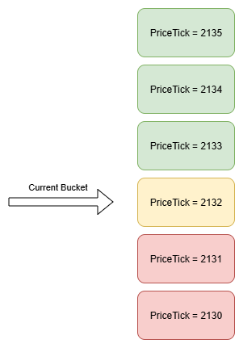

# Liquidating Security Pools
If a Security Pool becomes undercollateralized, it will start burning its Security Deposit at an exponentially increasing rate. This liquidation process can be stopped or prevented by:

1. Adding additional REP into the pool
2. Returning Complete Sets back into the Security Pool
3. Hoping for REP price to increase
4. Waiting for the market associated with the minted Complete Sets to end, after which those sets are no longer counted as outstanding debt for the pool
5. Moving the debt over to some other security pool

The purpose of the liquidation process is to ensure that Security Pool holders maintain the system’s most important inequality:

$$
\text{REP Market Capitalization} > \text{Open Interest}
$$

If this inequality is violated, the penalty is designed to benefit other REP holders through token burns, as they are the ones who bear the risk before Open Interest holders.

## Liquidation Process
Liquidation in PLACEHOLDER is implemented somewhat differently compared to other liquidation protocols in DeFi or TradFi. We do not need to punish Security Pool holders quickly, nor do we want to rely on highly accurate price oracles. When the liquidator detects that a pool is undercollateralized, it gradually burns the Security Deposit of that pool - a process we call bleed liquidation.

PLACEHOLDER’s liquidator enables a single keeper to monitor and trigger liquidations across all Security Pools whenever price changes affect their health factors. This removes the need for multiple keepers or pool-by-pool monitoring. A single keeper - or even an automated trigger tied to price updates - can initiate or halt liquidations across all pools simultaneously. However, keepers are still required to remove REP from individual pools if a pool remains in liquidation for an extended period (covered later).

The liqudator burns the Security Pools deposit with exponential decay:
```math
\text{Security Deposit}_{\text{time} = t} = \text{Security Deposit}_{\text{time} = 0s}  \cdot 2^{-\text{Burn Rate} \cdot t}
```

If the burn is stopped at any point, the decay resets and the burn starts over again if its applicable. The `Burn Rate` is set in such way that after one week of constant burning, half of the deposit is burnt:
```math
\text{BurnRate} = \frac{1}{604800}
```

## Health Factor

The health of a Security Pool can be measured using its Health Factor:

```math
\text{Health Factor} = \frac{\text{Security Deposit}_{REP} \cdot \text{Security Multiplier}}{\text{Security Bonds Issued} \cdot \frac{REP}{ETH}}
```

Where:

* Health Factor ≥ 1: The pool is safe. Higher values indicate stronger collateralization.
* Health Factor < 1: The pool is undercollateralized and subject to liquidation.

In this equation, the only variables that can change without users input is the price $\frac{REP}{ETH}$ and $\text{Security Deposit}_{REP}$ (liquidation decreases security deposit). Other parameters remain fixed unless a pool-specific action occurs. If position has not been liquidated, the formula simplifies to:

```math
\text{Health Factor} = \frac{\text{Constant}}{\frac{REP}{ETH}}
```

If a liquidation has continued long enough that the Health Factor falls below the Keeper Liquidation Threshold (20%), a keeper may trigger liquidation for that pool and claim:

```math
\text{Liquidator bonus}_{REP} = \text{Keeper Liquidation Multiplier} \cdot \text{Liquidation Gas Cost} \cdot \text{Base Fee} \cdot \frac{REP}{ETH}
```

## Tracking Undercollateralization Duration

For a bleed liquidator, our focus shifts away from the exact health factor values and toward how long a pool has remained undercollateralized (i.e., how long its health factor has stayed below 1).

Rather than liquidating an unhealthy pool immediately, we measure the duration of undercollateralization and apply a gradual penalty (such as burning a fixed percentage of its collateral over time). This enables lazy enforcement of liquidation penalties without constant per-block intervention or active monitoring.

Since price is the only continuously changing variable in the health factor formula, we can derive these undercollateralization periods entirely from price movements.

Instead of tracking this individually for each pool, we can introduce Price Buckets. These buckets record how long the price has remained under specific thresholds, creating a shared timeline that can be used across all pools. Any pool can then reference this data to determine how long it has been unhealthy relative to its own critical price level, without needing its own dedicated tracking mechanism.

```ts
struct Bucket {
	uint256 cumulativeTimeUnder
	uint256 enteredAt
}
```
When the price crosses a bucket boundary:
- Update every intermediate bucket’s `cumulativeTimeUnder` and `enteredAt`
- Set the `enteredAt` timestamp for the new active bucket to the current time.

If price remains within a bucket, no updates are necessary. Prices can be bucketed using Uniswap-style ticks:

```math
\text{sqrtPriceX96} = \sqrt{1.0001^{\text{tick}}} * 2^{96}
```



Since liquidation monitoring doesn't require extremely fine-grained precision, we can use coarser tick intervals. This reduces the frequency of tick crossings, lowering gas costs for updates. While Uniswap uses a maximum tick spacing of 0.01% (1 basis point), we can use a tick spacing of 100, which provides tick accuracy of 1%.


## Parameters

| Parameter                     | Value                  |
| ----------------------------- | ---------------------- |
| Security Parameter            | 2                      |
| Burn Rate                     | $\frac{1}{604800}$     |
| Keeper Liquidation Treshold   | 20%                    |
| Keeper Liquidation Multiplier | 4                      |
