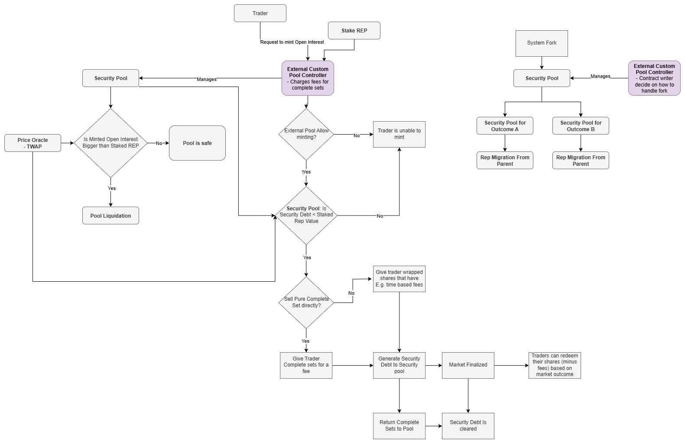

# Security Pools



Security Pools in PLACEHOLDER are conceptually similar to MakerDAO’s Collateralized Debt Positions (CDPs). In MakerDAO, users deposit ETH as collateral to borrow DAI. In PLACEHOLDER, users deposit REP tokens as a Security Deposit and create Security Bonds backed by that REP. Each Security Bond enables its holder to deposit one ETH into PLACEHOLDER and mint one Complete Set for every pair of ETH and Security Bond.

Like MakerDAO, keepers in PLACEHOLDER monitor Security Pools (or CDPs) to ensure that the amount of debt remains manageable. The key requirement in PLACEHOLDER is:

```math
\text{Security Bonds Minted} \leq \frac{\text{Security Deposit}}{\text{Security Multiplier} \times \text{Price}_{REP/ETH}}
```

For price data, we use Uniswap’s TWAP (Time-Weighted Average Price) oracles to estimate the REP/ETH exchange rate. Specifically, the oracle is a winzored geometric mean oracle.

We use Uniswap’s TWAPs differently depending on the operation:

1. When minting new Security Bonds, the above inequality must hold for both the 30-minute and 1-day TWAP prices.
2. If the inequality fails for the 1-day TWAP, the position becomes eligible for liquidation.

By managing your own Security Pool with your REP tokens providing Security Bonds, you can trade on PLACEHOLDER while only incurring the cost of locked capital.


## Security Bonds
When Security Pools mint Complete Sets, they generate debt measured in Security Bonds. Each Complete Set must be backed by 1 ETH and 1 Security Bond. This Security Bond debt can be cleared in three ways:

1) Returning Complete Sets for the same market back to the pool (these do not have to be the exact same Complete Sets originally minted by the Security Pool; Complete Sets minted by other Security Pools are also accepted).
2) When the Complete Set’s market ends, its associated debt is transferred to the Global Security Bond Debt.
3) Transferring your debt to another Security Pool, if that pool allows it and the transfer does not cause that pool to exceed its limits

### Global Security Bond Debt

While Security Pools have their local limits on how much Security Bonds they can generate, we also have a global limit:

```math
\text{Total Security Bonds Minted} \leq \frac{\text{REP Supply}}{\text{Security Multiplier} \times \text{Price}_{REP/ETH}}
```

If this requirement is broken for 30-minute or 1 day TWAP's the system does not allow minting more Security Bonds. Here

```math
\text{Total Security Bonds Minted} = \sum_i^{Pools} \left( \text{Security Bonds Minted}_i \right) \ + \ \text{Global Security Bond Debt}
```

When market is finalized, it's Global Security Bond Debt is cleared.

## [Liquidating Security Pool](./Liquidation.md)

### Security Pools Controllers
While some functions within Security Pools - such as triggering liquidation-can be executed by anyone, most operations are limited to their controllers. A controller can be either a regular Ethereum address or a smart contract. Controllers are responsible for defining how complete sets are minted.

The system itself does not charge any internal fees, but controllers enable REP holders to generate revenue. Only REP holders have permission to mint complete sets through Security Pools. This exclusivity allows REP holders to monetize access to complete sets.

Possible monetization strategies include:
1) Selling complete sets directly to anyone, with prices influenced by factors like market duration
2) Selling complete sets while simultaneously buying them back to mint new ones and maintain liquidity
3) Issuing wrapped complete sets that charge a time-based fee instead of distributing sets directly

Enabling REP holders to earn revenue is crucial because the security of the system depends on maintaining the inequality ($\text{REP Market Cap} > \text{Open Interest}$). Since the system imposes no fees itself, it is up to REP holders to develop effective methods for monetizing access to complete sets.

### Reporting via Security Pool
