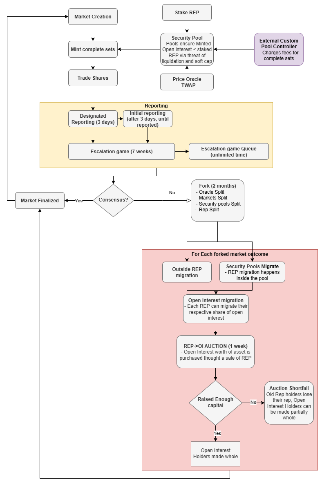

# PLACEHOLDER - a Decentralized Oracle and Prediction Market Platform

## Abstract

PLACEHOLDER is a game-theoretically secure, censorship-resistant oracle and prediction market protocol built on Ethereum. It allows users to create, trade, and resolve prediction markets while aligning incentives toward accurate reporting of real-world outcomes.

The design builds on the lessons of [Augur V2](https://github.com/AugurProject/whitepaper/releases/download/v2.0.6/augur-whitepaper-v2.pdf), with a key improvement: PLACEHOLDER is significantly more resistant to the parasitic interest problem described in the Augur V2 paper - a challenge long believed to be unsolvable.

At its core, PLACEHOLDER is built on the assumption that users will continue to adopt and support the honest version of the protocol, ensuring that the value of the ecosystem aligns with the truth. To achieve this, PLACEHOLDER introduces several novel mechanisms - including Truth Auctions, Open Interest Migration, Liquid Escalation Games, Security Pools, and fork-based protocol upgrades - to deliver a fully decentralized prediction market that operates without reliance on even a single centralized components.

## PLACEHOLDER Security Assumption

PLACEHOLDER's design is based on a set of core assumptions. While the system includes mechanisms to help uphold these assumptions, if they are broken the protocol may no longer function as intended. In some cases, the system might continue operating even if one or more assumptions fail, but its security can no longer be guaranteed.

1. **Users are greedy**: Users value more money over less money.
2. **A fork doesn't significantly lower the total value of the system**: Market cap of a previous universe equals ATLEAST market cap of the formed universes withing a security multiplier: 
```math
\text{Value of assets prior fork} \leq \frac{\sum_{\text{Future universes}}{\text{Value of assets}_{universe}}}{\text{Security Multiplier}}
```
3. **Market Cap ≈ Discounted Cash Flow**: Market Capitalization is a reasonable accurate proxy for Discounted Cast Flow of an asset.
4. **Users value honest universe(s)**: User prefers to use an universe that is honest in their opinion:
```math
\text{Value of assets prior fork } ≈ \text{Value of assets}_{\text{truthful universe}}
```
5. **Neglible operation costs**: Transaction fees (eg, gas fee) are neglible compared to financial value of the transactions.
6. **Access to information**: Users should have reliable and timely access to information in order to determine the most truthful outcome of a market.
7. **Migrating is not too hard**: Users, exchanges and other tools using the systems are okay to migrate into fork they believe is truthful.
8. **An auction is an efficient way to convert an asset into another**: Some amount of truthfull REP tokens can be sold for ETH lost in a fork for a small enough fee.
9. **Traders Hold Reputation tokens**: Traders hold enough REP to delay wrongly reported markets enough so that participants with more REP are alerted to continue disputing the market.
10. **Reputation is liquid**: REP token is liquid enough that reasonable amounts of it can be accessed from open market.
11. **The inequality is maintained**: The system is able to maintain inequality at all times: $$\text{Open Interest} < \text{REP's Discounted Cash Flow}$$
12. **Access to PLACEHOLDER is valuable**: Users find it valuable to be able to use PLACEHOLDER to access prediction markets and this value is atleast $\text{Security Parameter}$ times higher than the value it secures.
13. **The system has enough users**: The system requires enough non-colluding users to function, E. g, the prediction market trading requires atleast two participants with disagreeing views.
14. **Ethereum is censorship resistant**: The users should be able to send transactions on Ethereum that will be included on the chain in a reasonble timeframe.
15. **Some amount of REP tokens are held by honest reporters**: (todo, the number comes from escalation game / price oracle and its params)
16. **Non-colluding Price Oracle reporters**: The Price Oracle has atleast two non-colluding price reporters that are willing to risk certain amount of REP and ETH per each Price Oracle report.

## System Overview

- todo, add price oracle

### System Participants
PLACEHOLDER involves several types of participants. Below, we list the roles of participants that influence the behavior of the system.

- PLACEHOLDER market creators
- Traders (yes, no, invalid share holders)
- Open Interest holders
- REP holders
- REP reporters
- Security Pool holders
- Liquidation keepers
- PLACEHOLDER share market makers
- REP/ETH traders
- REP/ETH market makers
- Escalation Game participants
- Truth Auction participants
- Price Oracle reporters
- Price Orace arbitragers

## Creating Prediction Markets
Anyone can create a prediction market on PLACEHOLDER. To create a market you need to
1) Write up a **Market Description**
2) Decide what is **Market End Date**
3) Decide who is **Designated Reporter**
4) Deposit **Market Creator Bond** worth of $REP$ to the system.

For a market to be considered valid, it must follow the [Reporting Rules](./Reporting%20Rules.md). If a market does not follow these rules, it will be deemed Invalid - which is one of the possible reporting outcomes. PLACEHOLDER only supports markets that resolve to one of three outcomes: Yes, No, or Invalid. Under these assumptions, users can expect each market to resolve accurately based on the real-world event outcome.

## Minting Market Shares

To trade in a market on PLACEHOLDER, someone must first mint Complete Sets for the market. A Complete Set is a bundle of tokens made up of equal amounts of Yes, No, and Invalid shares, and is tied to a specific market (each market has its own Complete Sets).

Users can obtain Complete Sets or its parts in several ways, E.g:

1. Create a personal Security Pool that mints Complete Sets using ETH and REP
2. Purchase Complete Sets or market shares directly from other traders in the market
3. Buy Complete Sets from an Open Security Pool
4. Contribute REP to an Open Security Pool that allows its members to mint Complete Sets

### [Security Pools](./SecurityPools.md)

## Trading
Once a user acquires a Complete Set for a market, they can sell portions of it to take a position. For example, selling all No shares from a Complete Set effectively gives the user a Yes position. If the market resolves to Yes, the user can redeem their Yes shares for 1 ETH each while keeping the profit from the previously sold No shares.

Market shares can be traded on external platforms. PLACEHOLDER does not provide built-in trading functionality. However, because anyone can create a market on PLACEHOLDER, the platform may accumulate many low-quality or poorly defined markets. This makes it difficult for traders to separate well-structured markets from those that risk resolving as invalid.

To mitigate this, trading platforms can adopt several approaches:
* Implement "invalid market insurance," where traders are refunded if a market resolves as invalid. This reduces the incentive to create invalid markets and improves overall market quality.
* Allow trading of invalid shares, giving users a signal that a market may be invalid before resolution.
* Curate markets directly, with the external platform filtering or highlighting higher-quality markets to lower the risk of invalid outcomes.

## Reporting
When market ends; current time is past Market End Date. The Designated Reporter can report on the market according to what actually happened in the real world. The designated reporter decides if the market resolves as Yes, No or Invalid. The Designated Reporter has Designated Reporter Time to do this. If they fail to do this, anyone can report on the market (Open Reporting). This person or Designated reporter is called as Initial Reporter. There is no deadline for Initial Reporter to report on the market.

### Disputing
If users disagree with the initial report, they can dispute the market by staking REP. This initiates an [Escalation Game](Escalation%20Game.md). If the Escalation Game times out, the market finalizes with its current outcome. Once finalized, the Global Security Bond Debt for that market is cleared, and traders can redeem their Yes, No, or Invalid tokens for ETH according to the outcome.

#### Disputing via Security Pool
Users can also participate in the Escalation Game using REP they personally hold or REP staked within a Security Pool. Using REP from a Security Pool does not immediately remove it from the pool. However, if that REP is lost in the Escalation Game, it is taken from the pool and awarded to the winner.

Each Security Pool can allocate at most 50% (Security Pool Escalation Game Participation Fraction)of its REP to an Escalation Game. This limit prevents excessive Open Interest from being exposed without proper accounting through a single pool.

## [Escalation Game](Escalation%20Game.md)

## Fork
If PLACEHOLDER's Escalation Game fails to find consensus on the outcome, PLACEHOLDER enters into a fork state, during forking state:
1) No market can finalize
2) No market can be created on parent universe (allowed for childs)
3) Escalation games (other than the one that triggered fork) allow all participants to receive their REP stake back
4) No new escalation games can be created
5) No complete sets can be created anymore
6) Complete sets can be redeemed for ETHs before **ETH Migration** is triggered
7) Security Pool Security Bond Minting, Liquidations, REP withdrawals and REP Deposits are al disabled
8) Security Pools of child universe can mint Security Bonds, do REP withdrawals and deposits, but cannot be liquidated.

When fork is triggered, PLACEHOLDER splits into yes/no/invalid universes, these are called child universes, the current universe is called parent universe from perspective of child universes. Child universes have all the non-finalized parent markets migrated over.

Universe is a system that holds it's own Reputation token, it's own markets, its own market shares and such. Different universes are independent of each other, other than the forking process.

The fork state lasts $\text{Fork Duration}$.

### REP Migration
All REP holders will have $\text{Fork Duration}$ amount of time to migrate their REP to one of the child universes. Any REP that participated in the escalation game that triggered the fork automatically migrates to the universe it was staked on. The REP in other escalation games is released and the owner of it can choose any child universe it belongs into.

Market Creator Bonds are returned to the market creators. After this point, existing markets no longer have a Market Creator Bond attached. Once such a market ends, anyone can submit the initial report by posting a REP bond along with their report.

#### Security Pool Migration
When PLACEHOLDER undergoes a fork, the security pools fork as well. The Security Pool Controller must determine how much REP to migrate into each forked branch. The Controller can split REP across multiple branches, which is particularly useful when managing REP on behalf of multiple users rather than a single account.

During a fork, security bonds in the Security Pool are duplicated and minted in every universe. As a result, even a healthy Security Pool may face liquidation, since the total number of Security Bonds remains the same while portions of its REP are migrated into other universes.

### ETH Migration
After the REP migration period ends ($\text{Fork Duration}$ period), complete sets can no longer be redeemed for ETH. Original REP token is frozen. The system will look at how the REP is distributed across universes and migrate all ETH proportionately to the REP migration. If 20% of REP migrated to universe A, 50% migrated to universe B, and 30% failed to migrate within the window then 20% of the ETH would migrate to universe A, 50% of ETH would migrate to universe B, and 30% of ETH would remain behind.

This is game theoretically sound operation to make, as the REP migrating is more valuable than the migrating ETH, and the only way for the REP to maintain its value is to migrate into universe that maintains its value. REP holder can migrate into a false universe, to capture the ETH, but this makes the REP valueless. Here we are assuming that users prefer trading on an universe that reports truth and thus are willing to pay the oracle for this. And the fork does not have a significant negative impact on the systems value or traders willing to trade there.

The ETH that remains behind is distributed to REP holders who failed to migrate. The REP becomes worthless at this point and serves no purpose other than to redeem for ETH. Transfers remain enabled so people can withdraw REP from exchanges and other contracts in order to redeem for ETH, but it no longer serves any purpose within the system.

## Truth Auction: ETH for REP Auction
On each universe, a dutch auction is started right after when ETH migration is finalized. In the auction, people are bidding ETH in exchange for REP of the given universe. The auction starts by offering $\frac{\text{REP Supply}}{\text{Dutch Auction Divisor Range}}$ REP for the needed amount of ETH and the amount of REP offered increases every second until it reaches $\text{REP Supply}\cdot \text{Dutch Auction Divisor Range}$ REP offered. The auction ends when either (A) one or more parties combined are willing to buy the ETH deficit for the current REP price or (B) it reaches the end without enough ETH willing to buy even at the final price. The final prize is reached when the auction has lasted $\text{REP to ETH Auction Length}$.

The auction participants are also able to submit non-cancelable limit orders to the auction "I am willing to buy 100 REP with price of 10 ETH", these limit orders can be submited right after the system has entered into a fork state, even thought the auction itself has not yet started.

### Auction Success
The REP that auction participants receive will be minted and distributed when the auction finalizes. Every auction participant get the same price for the REP. The auction proceeds of the auction will be added to the top of the Migrated ETH and complete sets can be redeemed and created again at 1:1 value.

### Auction Shortfall
If the auction fails to raise the necessary ETH then the CASH contract's redemption price will be adjusted accordingly and CASH is no longer backed by 1:1 of ETH.

In the case of auction failure to raise enough ETH to cover traders before minting 1000x of migrated supply of REP, all auction participants will be refunded and the auction will be cancelled. The universe will shutdown except for withdraws of OI at a reduced price from their intended value.

## Market Duration
The longer a market exists on PLACEHOLDER, the higher likelihood is that the markets complete sets are not backed by bigger amount of REP held in security pools. The longer markets are thus more vulnerable than shorter markets. For this reason, PLACEHOLDER, limits markets length to maximum of one year ($\text{Max Market Duration}$).

There is a partial way to bypass this limitation. An external system can be set up to create a one-year market and, once it finalizes, launch a new long market. The system would then close the open interest in the previous market and transfer it to the next one. This strategy works as long as PLACEHOLDER allows the same amount of open interest to be created again, which is possible if both the global and local requirements of the security pools are satisfied.

## Market Creator Bond Size

The Market Creator Bond serves two main purposes:

1. It ensures that someone will report on the market - otherwise the creator risks losing their bond.
2. Once the Initial Reporter has submitted a report, the bond provides enough incentive for disputers to challenge it if the report is incorrect.

In addition, the bond must satisfy two requirements:

1. It must be a positive value, so that the Escalation Game can begin.
2. It must be smaller than the Fork Threshold; otherwise, the escalation process would be skipped entirely.

From the second purpose, we can derive the following lower bound:

```math
\text{Market Creator Bond} \geq \text{Base Fee Uncertainty Multiplier} \cdot \text{Base Fee} \cdot \text{Gas Amount to Dispute} \cdot (1 + \text{Initial Dispute Profit Expectation})\cdot (1 + \frac{\text{Burn Share}}{2}) \cdot \frac{REP}{ETH}
```

Where:

* **Gas Amount to Dispute** includes the gas cost of both submitting the dispute and later claiming back the funds.
* **Base Fee Uncertainty Multiplier = 6** accounts for possible fee increases between the time of dispute and claim.
* **Initial Dispute Profit Expectation = 100%** should be high enought to incentivize disputor to risk atleast equal amount of rep to profit from. 
* **Burn Share = 20%**, based on the escalation game rules.

And from the requirements we get that the Market Creator Bond must lie within the range:

```math
0 < \text{Market Creator Bond} < \text{Fork Threshold}
```

## Upgrading Protocol
PLACEHOLDER supports voluntary contract upgrades through the following process:

1. The upgrading party initiates a fork of the system.
2. REP holders may migrate into the UPGRADE universe (instead of YES, NO, or INVALID), which represents the new protocol.
3. The UPGRADE universe receives REP and ETH in the same way as any other fork branch.
4. The new protocol may optionally refund the party that triggered the fork by minting REP for them.

Users who choose not to migrate can continue using PLACEHOLDER in the original universe as normal.

## [Price Oracle](Price%20Oracle.md)

## Ambiguous Markets
Ambiguous markets are those whose resolution criteria are unclear - they are neither clearly invalid nor clearly valid, but exist in a gray area between the two. PLACEHOLDER cannot fully defend against such markets, so the best approach is to avoid interacting with them altogether.

## Parameters

| Parameter                                            | Value                                |
| ---------------------------------------------------- | ------------------------------------ |
| Escalation Game Time Limit                           | 7 weeks                              |
| Fork Theshold                                        | 2.5% of REP Supply                   |
| Security Multiplier                                  | 2                                    |
| Fork Duration                                        | 8 weeks                              |
| Designated Reporter Time                             | 3 days                               |
| Dispute Period Length                                | 4 days                               |
| REP to ETH Auction Length                            | 1 week                               |
| Dutch Auction Divisor Range                          | 1 000 000                            |
| Security Pool Escalation Game Participation Fraction | 50%                                  |
| Max Market Duration                                  | 1 year                               |
| Base Fee Uncertainty Multiplier                      | 6                                    |
| Initial Dispute Profit Expectation                   | 100%                                  |
| Burn Share                                           | 20%                                  |

# Open Questions
- Should we have turnstile?

## Random ideas (not planned to be implemented for now)

### Speed limit on how much OI can be minted
We could make the system only allow minting certain amount of open interest per day to limit big changes to open interest

### Add training wheels
Introduce global limits on OI and REP that gradually increase over time. This helps phase out attackers early while minimizing potential losses to the system.

### Add Turnstile

A turnstile mechanism could be introduced to ensure that REP holders actively participate in the reporting system. This would filter out passive holders who keep REP but fail to defend the system during an attack.

One possible design is that a random market is selected and forced into a fork. This compels REP holders to take an action that is intentionally difficult to automate, thereby proving active engagement.

The turnstile would also gradually reduce the total REP supply, leading to a more accurate measure of active participation in the system. In addition, REP that is no longer accessible (for example, tokens locked behind lost private keys) would effectively be removed, further strengthening the integrity of supply measurements.

### Invalid Market Controller

In Augur V2, the Invalid Market Controller increases the Market Creator Bond size when invalid markets appear, discouraging their creation in the future.

As an additional safeguard, the Market Creator Bond could also be burned if the market ultimately resolves as invalid.
