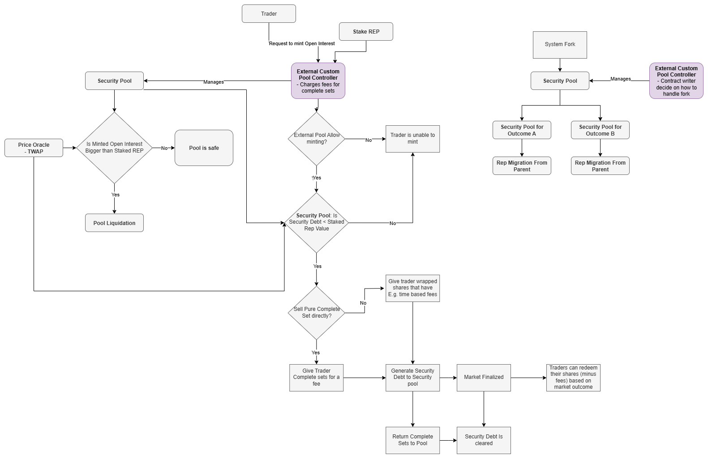
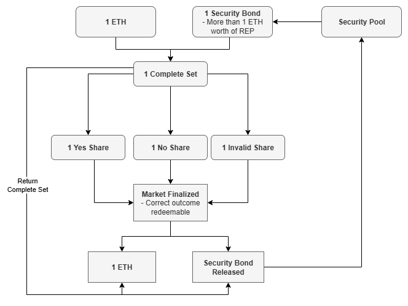

# PLACEHOLDER - a Decentralized Oracle and Prediction Market Platform

PLACEHOLDER is a game theoretically secure decentralized prediction market and oracle service running on Ethereum. PLACEHOLDER is built on ideas from Augur V2, DEFI protocols on and other oracles.


## PLACEHOLDER Security Assumption

1. **Users are greedy**: Users value more money over less money.
2. **A fork doesn't change the total value of the system**. Market cap of a previous universe equals ATLEAST market cap of the formed universes: 
```math
\text{value of assets prior fork }= \sum_{\text{future universes}}{\text{value of assets}_{universe}}
```
3. **Users value honest universe(s)**: User prefers to use an universe that is honest in their opinion:
```math
\text{value of assets prior fork } = \text{value of assets}_{\text{truthful universe}}
```
4. **Neglible operation costs**: Transaction fees (eg, gas fee) are neglible compared to financial value of the transactions.
5. **Access to information**: Users should have reliable and timely access to information in order to determine the most truthful outcome of a market.
6. **Migrating is not too hard**: Users, exchanges and other tools using the systems are okay to migrate into fork they believe is truthful.

7. **Some amount of truthfull REP can be sold for ETH lost in a fork**:
	- **Zero trading fees**: When selling assets on open market to $REP$, you often have to pay trading fees, and which results in the assets to be worth less than their original value.
	- **Sufficient liquidity**: When selling big amount of assets, there might not be enough liquidity on the market and there's a lot slippage.
	- **Open interest < REP's market cap**: If $REP$'s market cap is less than the REP being sold, it's not even possible to get equal worth in $ETH$ as not enough $REP$ exists for that.
	- **REP needs to maintain its value**: After Open interest has been converted into $REP$, $REP$'s price might drop, causing users to lose value.

[TODO missing security pool assumptions]
[TODO missing escalation game assmptions]

## Creating Markets
Anyone can create market on PLACEHOLDER. To create a market you need to
1) Write up a **Market Description**
2) Decide what is **Market End Date**
3) Decide who is **Designated Reporter**
4) Deposit $\text{Market Creator Bond}$ worth of $REP$ to the system.

The created market needs to obey [Reporting Rules](./Reporting%20Rules.md) to be considered to be a valid market. Invalid markets will resolve into Invalid outcome. PLACEHOLDER only has markets that resolve into one of three outcomes: YES, No or Invalid.

## Minting Market Shares

To trade on a market in PLACEHOLDER, a user must first mint Complete Sets. A Complete Set is a bundle of tokens composed of equal amounts of Yes, No, and Invalid shares, and is specific to a single market (each market has its own Complete Sets).

There are multiple ways to access Complete Sets in PLACEHOLDER, E.g,

1) Create a personal Security Pool that mints Complete Sets using ETH and REP
2) Purchase Complete Sets directly from other traders on the market
3) Buy Complete Sets from an Open Security Pool using ETH
4) Contripute REP to some Open Security Pool that grants it's members to mint complete sets

### Security Pools



Security Pools are somewhat similar to MakerDAO's Collateralized Debt Positions. In Maker, one needs to deposit ETH and you can borrow DAI against the ETH. In PLACEHOLDER, one deposits REP and one can create Security Bonds against REP. Security Bonds allow an user to deposit 1 ETH for each security bond to the PLACEHOLDER and mint one Complete Set against every pair of eth and security bond. Similar to Maker, In PLACEHOLDER, keepers keep track of the CDP/Security pools, that they have not too much debt that they cannot handle. In PLACEHOLDER, this requirement is:

```math
\text{Minted Complete Sets} \leq \frac{\text{Security Deposit(REP)} }{\text{Security Multiplier} \cdot \text{TWAP}_{REP/ETH}}
```

Here $\text{TWAP}_{REP/ETH}$ is a 1 hour Time-Weighted Average Price oracle, from Uniswap V3.

PLACEHOLDER never allows user to create Complete Sets if this inequality does not hold. However, it can get broken if the value of ETH grows against ETH. In this case Keeper can liquidate the pool.

Creating your own security pool with your own REP, allows you to utilize PLACEHOLDER with only cost of capital lockup.



### Security Bonds
When Security Pools mint Complete Sets, they generate debt in terms of Security Bonds. Each complete set needs to be backed by 1 ETH and by 1 Security Bond. This Security Bond debt can be cleared by two means:
1) Returning Complete Set (These do not need to be the exact same Complete Sets minted by the Security Pool, but also ones minted by other Security Pools are ok) back to the pool
2) The market the security bond is for is finalized, and the debt gets cleared immediadely

### Liquidating Security Pool
If a Security Pool becomes undercollateralized (underwater), it begins burning its **Security Deposit** at an exponential decay rate. This liquidation process can be stopped or avoided by:

1. Depositing additional REP into the pool
2. Returning (depositing) Complete Sets back into the Security Pool
3. Waiting for the market price to recover
4. Waiting for the market associated with the minted Complete Sets to finalize, after which those sets are no longer counted as outstanding

[TODO: add parameters and describe this better]

### Security Pools Controllers
While some functionalities within Security Pools (such as triggering liquidation) can be performed by anyone, the majority of operations are restricted to their controllers. Contoller can be a normal Ethereum address, or it can be a smart contract. Controllers define mechanisms for how complete sets can be minted.

The system itself has no internal fees, but controllers provide a way for REP holders to generate revenue. REP holders are the only participants permissioned to mint complete sets through Security Pools. This exclusivity enables REP holders to monetize access to complete sets.

Possible monetization strategies include:

1. Selling complete sets directly to anyone, with pricing based on factors like market duration
2. Selling complete sets while also buying them back to mint new ones and maintain liquidity
3. Issuing wrapped complete sets with a time-based fee instead of distributing them directly

Enabling REP holders to earn revenue is critical because the security of the system depends on maintaining a sufficiently high REP market cap (explained later). Since the system itself does not impose fees, it is up to REP holders to design effective strategies for monetizing access to complete sets.

## Trading
Once a user acquires a Complete Set for a market, they can sell parts of it to take a position. For example, selling all No shares from a Complete Set effectively places the user in a Yes position. If the market resolves to Yes, the user can redeem their Yes shares for 1 ETH each and keep the profit from having sold the No shares.

In most cases, Complete Sets are redeemable for 1 ETH (though there are exceptions [TODO: clarify exceptions here]).

Market shares can be traded on various external trading platforms, as PLACEHOLDER itself does not provide trading functionality. However, because anyone can create a market on PLACEHOLDER, the platform may accumulate a large number of low-quality or poorly defined markets. This makes it challenging for traders to distinguish between well-constructed and potentially invalid markets.

To address this, it is recommended that trading platforms implement some form of "invalid market insurance." Under such a system, if a market resolves as invalid, traders would be refunded. This would reduce the incentive to create invalid markets and improve overall market quality.

## Reporting
When market ends; current time is past **Market End Date**. The **Designated Reporter** can report on the market according to what actually happened in the real world. The designated reporter decides if the market resolves as Yes, No or Invalid. The Designated Reporter has **Designated Reporter Time** to do this. If they fail to do this, anyone can report on the market. This person or Designated reporter is called as **Initial Reporter**. There is no deadline for **Initial Reporter** to report on the market.

### Disputing
If users disagree with the **Initial Reporter**, they are able to dispute the market by staking REP, this will start an [Escalation Game](Escalation%20Game.md). If the escalation game ends up as a timeout, the market finalizes at its outcome. After the market has finalized the Security Bond Debts of Security Pools are cleared for this market and traders can redeem their Yes, No or Invalid tokens to ETH depending on which outcome the market finalized on.

#### Disputing via Security Pool
Users are able to participate Escalation Game by using REP they have or REP staked to a Security Pool. Participating the game with a Security Pool does not remove the REP from the Pool right away. However, if the REP staked by this way gets lost in the escalation game, it gets pulled out from the Security Pool and given the winner of the game.

#### Escalation Game
[TODO, should we handle the OI fees somehow(?), as we don't know what they are nowadays]
A *Battle of Isonzo* represents a single escalation game within the system. Each battle concludes with one of the following outcomes: `INVALID`, `YES`, `NO`, or `FORK`.

The battle begins when the designated reporter submits an initial `Start Deposit` in $REP$ tokens. This triggers a 1-week resolution timer. If no one disputes the market during this period, the outcome proposed by the reporter is finalized.

However, the battle can be escalated by any participant who deposits more than the current total on the leading outcome

Once a battle is active, anyone may deposit $REP$ on any side. The game functions as a war of attrition: escalating the battle becomes increasingly expensive over time. The cost to participate grows exponentially, following this formula:

```math
\text{Attrition Cost} = \text{Start Deposit} \cdot \left( \frac{\text{Fork Threshold}}{\text{Start Deposit}} \right)^{\frac{\text{Time Since Start}}{\text{Time Limit}}}
```

### Starting Parameters
| Parameter      | Value   |
| -------------- | ------- |
| Start Deposit  | 1 REP   |
| Fork Threshold | 10 REP  |
| Time Limit     | 7 weeks |

We get following cumulative cost to stay in the battle given each week:

If, at any point in time, only one side has successfully paid the attrition cost, the battle ends and that outcome is finalized.

Alternatively, the battle ends in a `FORK` if **two or more sides** each manage to deposit the full `Fork Threshold` amount. In this case, the market enters a fork, allowing the creation of separate universes. Notably, **it is not possible** to deposit more than the `Fork Threshold` on any single side.

### Solving for Resolution Timing

To estimate how much capital is required to push a resolution by a specific time, we can solve for `Time Since Start` in the attrition cost equation. This helps participants plan their capital commitments strategically:

```math
\boxed{
\text{Time Since Start} = \text{Time Limit} \cdot \frac{\ln \left( \frac{\text{Attrition Cost}}{\text{Start Deposit}} \right)}{\ln \left( \frac{\text{Fork Threshold}}{\text{Start Deposit}} \right)}
}
```

### Late Entry into a Battle

An interesting feature of the system is that participants can join an ongoing battle at any time. For example, if `YES` and `NO` are actively competing, the `INVALID` side can still enter later by depositing the required attrition cost at that point in time.

In other words, **it is not necessary to be part of the battle from the beginning** - but joining later requires paying the full cumulative cost up to that moment.

### Rewards and Settlement
When a battle ends:
* The winning side receives twice the amount of their Binding Stake. The non-binding stake is returned as it is.
* In the case of a `FORK`, each winning side in the forked universes is rewarded accordingly.
* Losing sides lose all their invested capital

**Binding Stake** refers to the amount of funds that were:
* Deposited during the battle
* Matched by at least one opposing side

If three sides are involved (e.g., `YES`, `NO`, `INVALID`), and one side loses, the losing side’s funds are burned. This mechanism ensures that winners are always rewarded with a 2x return on their matched stake.

Optionally, a portion of the winning side's stake can also be burned to discourage griefing. For example, Augur V2 burns 20% of the deposit to impose a small cost on participation and limit risk-free trolling.

> [!NOTE]
>
> #### Example Gameplay
>
> 1. Bob reports a market outcome as `YES` and stakes 1 $REP$ as the starting deposit. This initiates the game, and the market is set to resolve in 1 week if undisputed.
>
> 2. After 1 day, Alice sees the market and believes the correct outcome is `NO`. To dispute, she must stake more than 1 $REP$ on `NO`. She chooses to stake 3 $REP$.
>
>	* This updates the attrition cost and increases the timer to approximately: $t = 7 \cdot \frac{\ln(3)}{\ln(10)} ≈ 3.34 \text{ weeks}$
>
> 3. No one disputes Alice’s `NO` stake over the next 6 days, so the battle ends with the outcome `NO`.
>
> 4. As the winner, Alice can claim 1 $REP$ from Bob (her opposing matched stake), resulting in a net gain of 1 $REP$.

## Capping the Capital

The Battle of Isonzo still shares a core vulnerability with Augur V2:
An attacker can initiate multiple disputes across many markets simultaneously. Unless honest participants have enough capital to defend all of them, attackers can overwhelm the system.

To address this, The Isonzo Front introduces a priority queue and a global capital cap.

### Freeze Threshold

Under normal conditions, The Isonzo Front behaves similarly to Augur V2 - multiple escalation games can run in parallel. However, once the total binding capital across all active battles exceeds a predefined Freeze Threshold, the system enters a special Freezing State.

For example, the Freeze Threshold can be defined as:

```math
\text{Freeze Threshold} = 3 \cdot \text{Fork Threshold}
```

### Freezing State Behavior

When the system enters the Freezing State:

* The top three markets (by binding capital) are selected.
* These markets become immune to freezing for the rest of their lifecycle.
* All other markets are frozen.

Frozen markets can still receive new stakes, but their Attrition Cost remains fixed (i.e., does not increase with time) while the system is in the Freezing State.

### Exiting the Freezing State

The system exits the Freezing State once the total binding capital drops below the Freeze Threshold. After exiting:
* All frozen markets resume normal attrition behavior.
* Markets that were granted immunity remain permanently immune.
* If a new freeze occurs and fewer than three markets are currently immune, new ones are added from the priority queue until the three-slot immunity is filled again.

### Worst-Case Capital Requirement for the Honest Side

In the worst case, attackers create as many markets as possible and submit incorrect reports via designated reporters. The honest side is then forced to defend all these markets, which maximizes their capital requirements.

Before the system enters the Freezing State, the maximum number of active, disputed markets is:

```math
\text{Number of Disputed Markets} = \left\lfloor \frac{\text{Freeze Threshold}}{\text{Start Deposit}} \right\rfloor
```

Adding one more market at this point will push the system into Freezing State.

After the system freezes:
* The top three markets (by binding capital) become immune.
* Honest participants only need to defend these three, up to the Fork Threshold.

Thus, the worst-case capital requirement for the honest side is:

```math
\text{Worst Capital Requirement} = \text{Freeze Threshold} + \text{Start Deposit} + \text{Number of Immune Markets} \cdot (\text{Fork Threshold} - \text{Start Deposit})
```

Assuming:

* `Freeze Threshold = 3 × Fork Threshold`
* `Number of Immune Markets = 3`

Then:

```math
\text{Worst Capital Requirement} = 6 \cdot \text{Fork Threshold} - 2 \cdot \text{Start Deposit}
```

This is a reasonably bounded and predictable worst-case scenario, and a significant improvement over systems like Augur V2.

### Practical Worst Case

Despite this theoretical bound, practical capital requirements may be higher due to stake lock-up. If honest stakers commit funds to markets that later get frozen and don't progress, that capital is stuck without increasing attrition cost-effectively wasting resources.

To mitigate this, one possible improvement is to allow users to withdraw non-binding capital from frozen markets (i.e., funds not currently matched by an opposing side).

### Ongoing Capital Commitments

Honest stakers must always ensure they have at least a tiny edge in each battle to guarantee correct resolution. In practice, it may be wise to maintain one week's worth of attrition capital on each active market, so that they only need to check and reinforce their positions once per week.

## Reward for Prestaking

In closely contested battles, it can be risky for defenders to wait until the timer is nearly expired. An attacker might stake just enough additional capital at the last moment to tip the outcome in their favor - leaving defenders with no time to respond.

To mitigate this risk, defenders must ideally maintain a buffer of capital on their side, ensuring they have enough time to react if the balance shifts. However, when both sides are nearly tied, there's little incentive for users to contribute more capital, since overflow capital (i.e., unmatched excess stake) does not earn additional rewards.

### Incentivizing Defensive Buffers

To solve this, the system can be designed to reward prestaking, by allowing a portion of the attacker's stake to be redistributed to early or buffered defenders. For example, we could reward one week's worth of prestaked capital from the attacker's pool if the defender side wins.

This ensures:
* Defenders have an incentive to stake early and maintain a buffer.
* Even if the attacker never closes the gap, defenders are compensated for their proactive commitment.
* There's always at least one week of decision time before attackers can potentially flip the market unopposed.

## Summary of Benefits

The Isonzo Front improves upon the Augur V2 escalation game with several key enhancements:

1. **Supports Prestaking**
   Participants can stake early to avoid stake sniping and signal more clearly on how much capital is ready to defend.

2. **Caps Total Capital Requirement**
   By introducing a Freeze Threshold and prioritization mechanism, the system limits how much honest participants need to stake.

3. **Enables Instant Forking**
   If sufficient capital is committed, the system can fork immediately without delay, ensuring fast resolution for high-stakes disputes.

4. **Provides Flexible Participation**
   Even small capital contributions extend the timer.

5. **Predictable Escalation Curve**
   The capital required to extend the timer is easy to calculate and independent of other parties' behavior, making planning straightforward.

6. **Fairer Game Dynamics**
   The system ensures that the winning side only needs to lock slightly more capital than the losing side - promoting balance and fairness.

Here's Solidity pseudo code for the The Isonzo Front: [contracts/TheIsonzoFront.sol](./contracts/TheIsonzoFront.sol).

## Fork
If Escalation Game fails to find consensus on the outcome, PLACEHOLDER enters into a fork state, during forking state:
1) No market can finalize
2) No market can be created
3) Escalation games freeze
4) No new escalation games can be created
5) No complete sets can be created anymore
6) Complete sets can be redeemed for ETHs before **ETH Migration** is triggered

When fork is triggered, PLACEHOLDER splits into yes/no/invalid universes, these are called child universes, the current universe is called parent universe from perspective of child universes. 

Universe is a system that holds it's own Reputation token, it's own markets, its own market shares and such. Different universes are independent of each other.

The fork state lasts $\text{Fork Duration}$.

### REP Migration
All REP holders will have $\text{Fork Duration}$ amount of time to migrate their REP to one of the child universes. Any REP that participated in the escalation game that triggered the fork automatically migrates to the universe it was staked on. The REP in other escalation games is released and the owner of it can choose any child universe it belongs into. Exception to this is the REP staked as **Market Creator Bond** which gets migrated into all universes.

#### Security Pool Migration

### ETH Migration
After the REP migration period ends ($\text{Fork Duration}$ period), complete sets can no longer be redeemed for ETHs. The system will look at how the REP is distributed across universes and migrate all ETH proportionately to the REP migration. If 20% of REP migrated to universe A, 50% migrated to universe B, and 30% failed to migrate within the window then 20% of the ETH would migrate to universe A, 50% of ETH would migrate to universe B, and 30% of ETH would remain behind.

This is game theoretically sound operation to make, as the REP migrating is more valuable than the migrating ETH, and the only way for the REP to maintain its value is to migrate into universe that maintains its value. REP holder can migrate into a false universe, to capture the ETH, but this makes the REP valueless. Here we are assuming that users prefer trading on an universe that reports truth and thus are willing to pay the oracle for this. And the fork does not have a significant negative impact on the systems value or traders willing to trade there.

The ETH that remains behind is distributed to REP holders who failed to migrate. The REP becomes worthless at this point and serves no purpose other than to redeem for ETH. Transfers remain enabled so people can withdraw REP from exchanges and other contracts in order to redeem for ETH, but it no longer serves any purpose within the system.

## CASH for REP Auction
On each universe, a dutch auction is started right after when ETH migration is finalized. In the auction, people are bidding ETH in exchange for REP of the given universe. The auction starts by offering $\frac{\text{REP Supply}}{\text{Dutch Auction Divisor Range}}$ REP for the needed amount of ETH and the amount of REP offered increases every second until it reaches $\text{REP Supply}\cdot \text{Dutch Auction Divisor Range}$ REP offered. The auction ends when either (A) one or more parties combined are willing to buy the ETH deficit for the current REP price or (B) it reaches the end without enough ETH willing to buy even at the final price. The final prize is reached when the auction has lasted $\text{REP to ETH Auction Length}$.

The auction participants are also able to submit non-cancelable limit orders to the auction "I am willing to buy 100 REP with price of 10 ETH", these limit orders can be submited right after the system has entered into a fork state, even thought the auction itself has not yet started.

### Auction Success
The REP that auction participants receive will be minted and distributed when the auction finalizes. Every auction participant get the same price for the REP. The auction proceeds of the auction will be added to the top of the Migrated ETH and complete sets can be redeemed and created again at 1:1 value.

### Auction Shortfall
If the auction fails to raise the necessary ETH then the CASH contract's redemption price will be adjusted accordingly and CASH is no longer backed by 1:1 of ETH.

In the case of auction failure to raise enough ETH to cover traders before minting 1000x of migrated supply of REP, all auction participants will be refunded and the auction will be cancelled. The universe will shutdown except for withdraws of OI at a reduced price from their intended value.

## Market Migration
After auction has completed succesfully,

## Invalid markets

# Parameters

| Parameter      | Value   |
| -------------- | ------- |
| Open Interest Fee (yearly) | 50%  | 
| Time Limit     | 7 weeks |
| Number Of Weeks In a Year     | 52 weeks |
| Market Creator Bond | 0.4 REP | 
| Fork Theshold | 2.5% of REP CAP | 
| Security Multiplier | 2 | 
| Fork Duration | 8 weeks |
| Designated Reporter Time | 3 days | 
| REP to ETH Auction Length | 1 week | 
| Dutch Auction Divisor Range | 1 000 000 | 

# Open Questions
- how to do liquidations?
- how to fund TWAP
- how to maintain TWAP security?
- Should we have turnstile?

# Vocabulary

Token = 
REP = 
ETH = 
FORK =
Minting Tokens = Minting means creating tokens out of nowhere.